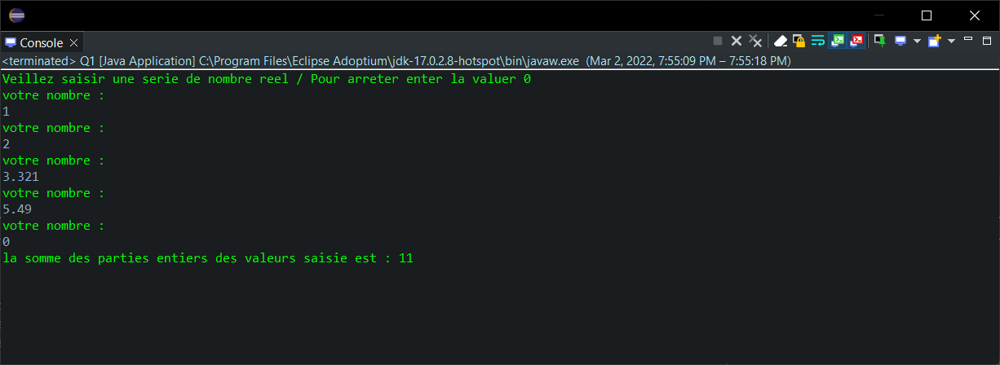
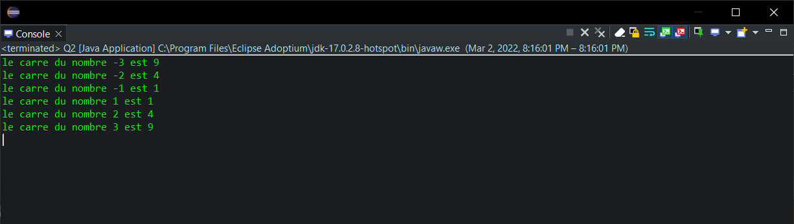
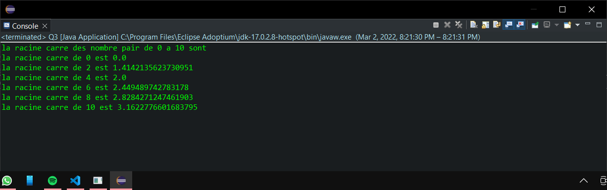
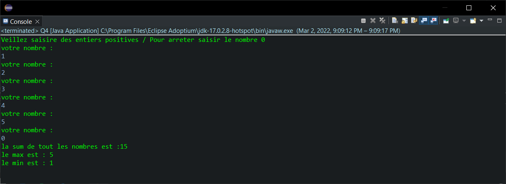
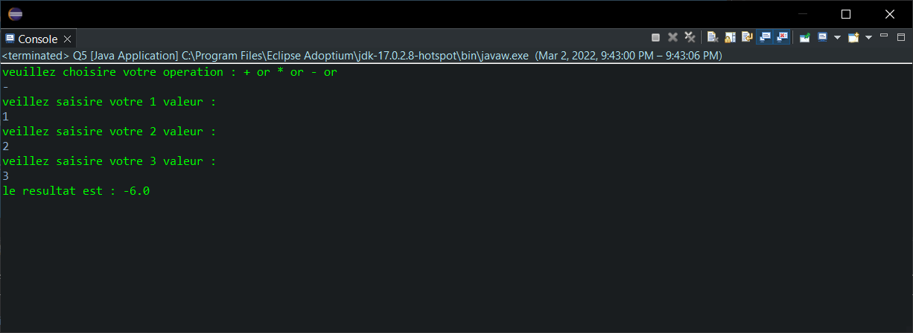
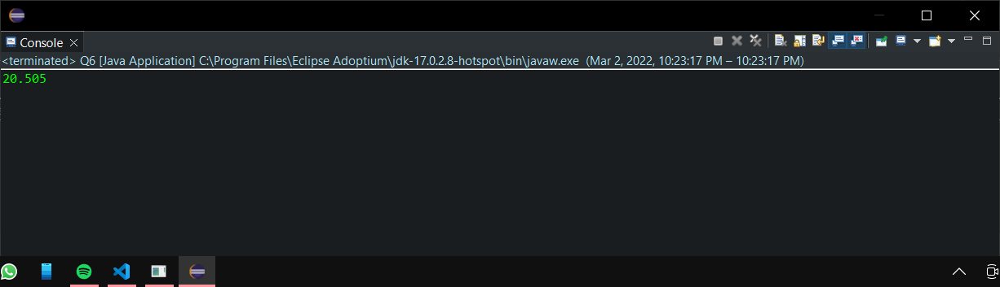
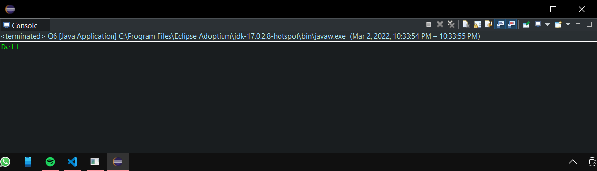
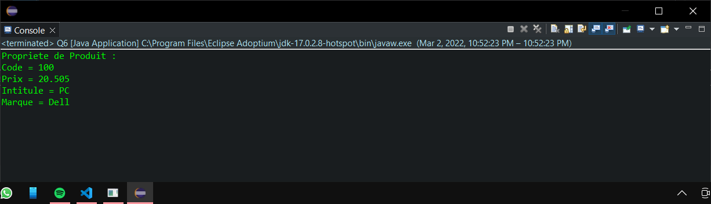
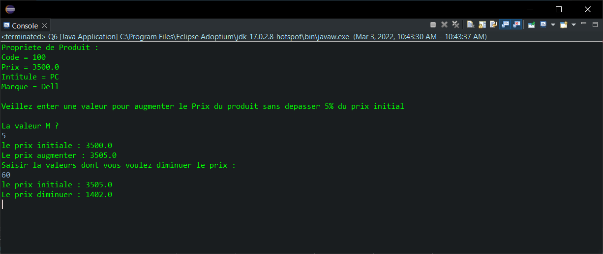
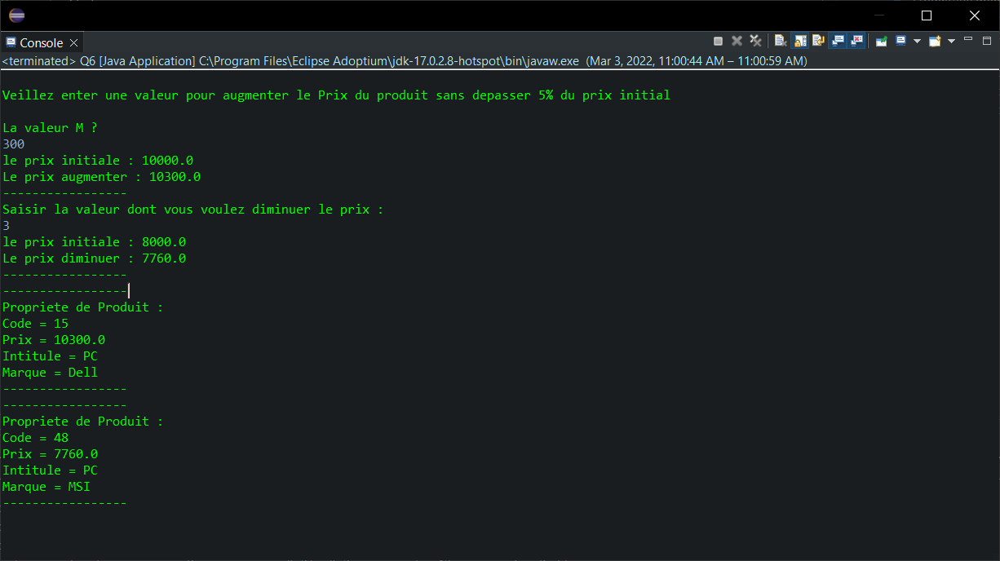

<div style="display:flex;justify-content:space-between">
    <div>
        <strong>
            Realise par :
        </strong>  
        <br>&nbsp;&nbsp;&nbsp;&nbsp;Yasser Nabouzi
        <br>&nbsp;&nbsp;&nbsp;&nbsp;Omar Lahbabi 
    </div>
    <div>
        <div>
            2021-2022
        </div>
        <div>
            
        </div>
    </div>
</div>
<br>
<div style="position:relative;bottom:51px">
    <strong>
        Filliere :
    </strong>  IID1
</div>
<div style = "text-align:center">
    <strong>
        Encadre par : 
    </strong>Noreddine GHERABI 
</div>
<div style="font-size:35px;font-weight:bold;text-align:center;">
    Rapport Des TPs Java
</div>
<!-- <div style = "color:#66c2ff;text-align:center">
Gestion des Salle ENSA KH
</div> -->

## TP1
### Q1:

```java 
import java.util.Scanner;
public class Q1 {
	public static void main(String[] args) {
		Scanner scan = new Scanner(System.in);
		System.out.println("Veillez saisir une serie de nombre reel / Pour areeter enter la valuer 0");
		float n ;
		int sum = 0;
		do {
			System.out.println("votre nombre :");
			n = scan.nextFloat();
			sum = sum + (int)n;
		}while(n !=0 );
		System.out.println("la somme entier des valeurs saisie est : "+sum);
	}
}
```
On importe le module **_java.util.Scanner_**  pour capturer les saisies de l'utilisateur 

> Input/Output :



### Q2:

```java 
public class Q2 {
	public static void main(String[] args) {
		for (int i = -3 ; i<= 3;i++) {
			if (i == 0) {
				continue;
				}
			System.out.println("le carre du nombre "+i+" est "+(int)Math.pow(i, 2));
			}
	}

}
```
> Input/Output:
> 

### Q3:

```java 
public class Q3 {
	public static void main(String[] args) {
		System.out.println("la racine carre des nombre pair de 0 a 10 sont ");
		 for (int i = 0 ; i<=10 ;i=i+2) {
			 System.out.println("la racine carre de "+i+" est "+Math.sqrt(i));
		 }
	}
}
 ```

> Input/Output:
> 


### Q4:

```java
import java.util.Scanner;
public class Q4 {
	public static void main(String[] args) {
		int n,m,max,min,sum;
		Scanner scan = new Scanner(System.in);
		System.out.println("Veillez saisire des entiers positives / Pour arreter saisir le nombre 0 ");
		System.out.println("votre nombre : ");
		sum = n = scan.nextInt();
		max = min = n;
		do {
			System.out.println("votre nombre : ");
			max = max > n ? max:n;
			min = n > min ? min:n; 
			n = scan.nextInt();
			if (n < 0 ) {
				System.out.println("Veillez saisir seulement des nombre positive !");
				continue;
			}
			sum = sum + n;
		}while(n != 0);
		System.out.println("la sum de tout les nombres est :"+sum+"\nle max est : "+max+"\nle min est : "+min);
	}
}
```

>Input/Output:


### Q5:

```java 
import java.util.Scanner;
public class Q5 {
	public static void main(String[] args) {
		Scanner scan = new Scanner(System.in);
		float res = 0,n;
		char c;
		System.out.println("veuillez choisire votre operation : + or * or - or");
		c = scan.next().charAt(0);
		switch(c) {
		case '+':
			for(int i = 0 ; i<3 ; i++) {
				System.out.println("veillez saisire votre "+(i+1)+" valeur :");
				n = scan.nextFloat();
				res +=n;
			}
			break;
		case '*':
			res = 1;
			for(int i = 0 ; i<3 ; i++) {
				System.out.println("veillez saisire votre "+(i+1)+" valeur :");
				n = scan.nextFloat();
				res *=n;
			}
			break;
		case '-':
			for(int i = 0 ; i<3 ; i++) {
				System.out.println("veillez saisire votre "+(i+1)+" valeur :");
				n = scan.nextFloat();
				res -=n;
			}
			break;
		default:
			System.out.println("veuillez ressayer et choisir une opperation valide ");
			break;
		}
		System.out.println("le resultat est : "+res);
	}
}
```

> Input/Output :
> 


### Q6:

- Implementation de la classe __Produit__:

 ```java 
 public class Q6 {
	static class Produit{
		int Code;
		String Intitule,Marque;
		double Prix;
	}
}
```
- Creation du constructeur par default :
```java 
Produit Prod = new Produit()
```
- Creation du constructeur qui utilise le Code et le prix comme argument :
```java
Produit(int code,double prix){
	Code = code;
	Prix = prix;
}
```
- Creation d'une methode qui accede le prix :
```java 
double getPrix() {
	return Prix;
	}	
```
> Input / Output :
> 
- Creation d'une methode qui accede la marque :
```java
String getMarque() {
	return Marque;
	}
```
> Input / Output :
> 
- Creation du methode __Afficher()__ qui affiche les valeurs des attributs du class Produit  :

```java
void Afficher() {
			System.out.println("Propriete de Produit :\nCode = "+Code+"\nPrix = "+Prix+"\nIntitule = "+Intitule+"\nMarque = "+Marque);
		}

public static void main(String[] args) {
Produit Prod = new Produit(100,20.505);
Prod.Marque = "Dell";
Prod.Intitule = "PC";
Prod.Afficher();
}
```
> Input / Output :
> 

- Creation du methode __Augmenter()__ :

```java
void Augmenter() {
			System.out.println("\nVeillez enter une valeur pour augmenter le Prix du produit sans depasser 5% du prix initial");
			double M,temp = Prix;
			do {
				System.out.println("\nLa valeur M ? ");
				M = scan.nextDouble();
				if (M > Prix * 0.05) {
					System.out.println("Veillez ressayer !! Sasire une valeur inferieur a 5% du prix");
				}
			}while(M > Prix * 0.05 );
			Prix += M;
			System.out.println("le prix initiale : "+temp+"\nLe prix augmenter : "+Prix);
}
```
- Creation de methode __Diminier()__:

```java 
void Diminuer() {
			if (Prix <1000) {
				System.out.println("le prix doit etre superieure a 1000dh pour le diminuer !!");
				return ;
			}
			else {
				System.out.println("Saisir la valeurs dont vous voulez diminuer le prix : ");
				double temp = Prix,N = scan.nextDouble();
				Prix = (Prix-Prix*(N/100));
				System.out.println("le prix initiale : "+temp+"\nLe prix diminuer : "+Prix);
			}
}
```
> Input/Output: (Pour les deux Methodes)
> 

- Creation de P1 et P2:
```java
public static void main(String[] args) {
		// Creation d'un constructeur par default (sans argument)
		Produit P1 = new Produit(15,10000);
		Produit P2 = new Produit(48,8000);
		P1.Marque = "Dell";
		P1.Intitule = "PC";
		P2.Marque = "MSI";
		P2.Intitule = "PC";
		// ajoutons 300dh a P1
		P1.Augmenter();
		// retranchons 3% de P2
		P2.Diminuer();
		// affichons les proprietes de P1 et P2
		P1.Afficher();
		P2.Afficher();
}
```
- AJoutons 300dh a __P1__ et retranchons 3% de __P2__ puis affichons les propietes de chacun __Produit__:
  
> Input/Output:
> 

