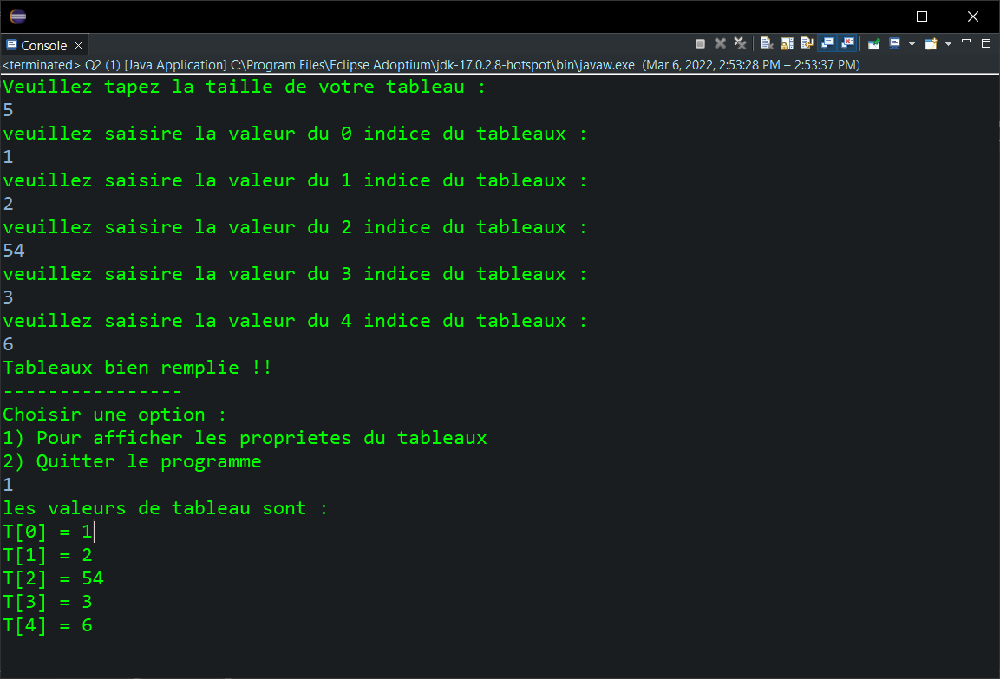
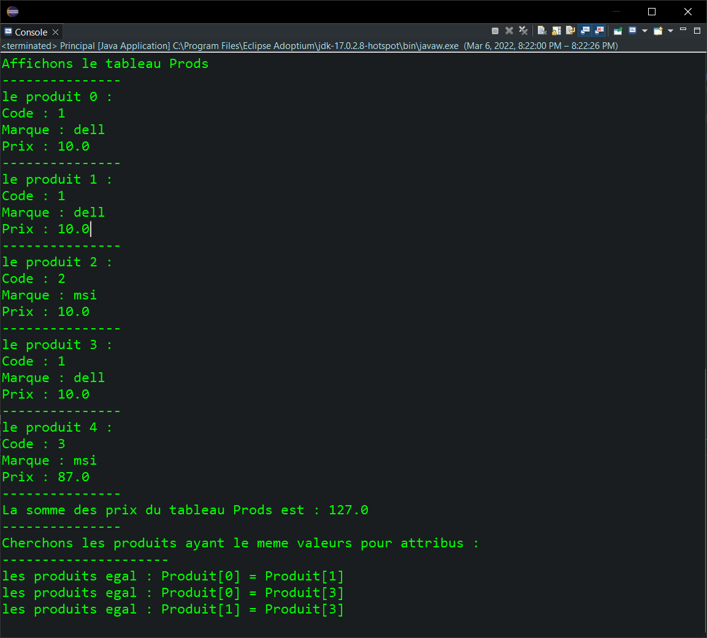

<div style="display:flex;justify-content:space-between">
    <div>
        <strong>
            Realise par :
        </strong>  
        <br>&nbsp;&nbsp;&nbsp;&nbsp;Yasser Nabouzi
        <br>&nbsp;&nbsp;&nbsp;&nbsp;Omar Lahbabi 
    </div>
    <div>
        <div>
            2021-2022
        </div>
        <div>
            
        </div>
    </div>
</div>
<br>
<div style="position:relative;bottom:51px">
    <strong>
        Filliere :
    </strong>  IID1
</div>
<div style = "text-align:center">
    <strong>
        Encadre par : 
    </strong>Noreddine GHERABI 
</div>
<div style="font-size:35px;font-weight:bold;text-align:center;">
    Rapport Des TPs Java
</div>

## TP2
### EXO1:
```java
import java.util.Scanner;
public class EXO1 {
	
	static String mot;
	static String text;
	static Scanner scan = new Scanner(System.in);
	
public static void main(String[] args) {
		
		System.out.println("veillez taper un mot : ");
		mot=scan.nextLine().toUpperCase();
		System.out.println("veillez votre text : ");
		text = scan.nextLine().toUpperCase();

		switch(mot.toUpperCase()) {
		case "ENSA":
			text = text.replace(mot, "");
			break;
		case "FST":
			text = text.replace(mot, "ENSA");
			break;
		case "ENCG":
			text = text + "ENCG";
			break;
		default:
			System.out.println("votre text contient aucune des valeurs lister : ENSA, FST, ENCG");
			break;
		}
		System.out.println(text);
    }   
}

```

> Input/Output :
> 


### EXO2 :
```java
import java.util.Scanner;
public class EXO2 {

	static Scanner scan = new Scanner(System.in);
	
	static void affiche(int[] T) {
		for (int i = 0 ;i < T.length;i++) {
			System.out.println("T["+i+"] = "+T[i]);
		}
	}

	public static void main(String[] args) {
		System.out.println("Veuillez tapez la taille de votre tableau :");
		int [] tab = new int[scan.nextInt()];
		for (int i = 0 ;i<tab.length;i++) {
			System.out.println("veuillez saisire la valeur du "+i+" indice du tableaux : ");
			tab[i] = scan.nextInt();
		}
		System.out.println("Tableaux bien remplie !!\n----------------\nChoisir une option : \n1) Pour afficher les proprietes du tableaux \n2) Quitter le programme");
		int choix = -1;
		do {
			choix = scan.nextInt();
		switch(choix){
		case 1:
			System.out.println("les valeurs de tableau sont :");
			affiche(tab);
			System.exit(1);
			break;
		case 2:
			System.out.println("merci !!");
			System.exit(1);
			break;
		default:
			System.out.println("veuillez saisire une option valide");
			break;
		}
		}while(choix !=1 || choix !=2);
	}
}
```

> Input / Output :
> 


### EXO3 :

#### Q1:
```java 
public class Produit{
		private int Code;
		public String Marque;
		private float Prix;
}
```
#### Q2:

- Creation du constructeur sans parametre :
```java 
public Produit() {
		Code = 0;
		Marque = "";
		Prix = 0;
    }
```
- Creation du constructeur avec parametre :

```java 
public Produit(int C,String M,float P) {
    Code = C;Marque = M;Prix = P;
    }
```
#### Q3:
Redifinissons la methode toString permettant de retourner les proprietes de la classe "Produit" :

```java
public String toString() {
	return "Code : "+Code+"\nMarque : "+Marque+"\nPrix : "+Prix;
}
```
#### Q4:
Ajoutons les getters and setters:
```java
public int getCode() {
    	return Code;
    }
    public void setCode(int code) {
    	Code = code;
    }
    public float getPrix() {
    	return Prix;
    }
    public void setPrix(float prix) {
    	Prix = prix;
    }
```

#### Q5:
creons la class principale :
```java
public class Principal {
	public static void main(String[] args) {
	}
}
```

#### Q6:
Creons la methode CalcPrix qui permet de calculer la somme des prix d'un tableau des produits :

```java
static float CalcPrix(Produit[] P) {
float sum = 0;
for (int i = 0 ; i<P.length ; i++) {
	sum = sum + P[i].getPrix();
    }
return sum;
}
```

#### Q7 

```java
public static void main(String[] args) {
		System.out.println("Combien de produit veuillez vous creer ? ");
		Produit [] prods = new Produit[scan.nextInt()];
		for (int i = 0 ; i< prods.length ; i++) {
			prods[i] = new Produit();
			System.out.println("Produit NUM :"+(i+1)+"\nCode :");
			prods[i].setCode(scan.nextInt());
			System.out.println("le Prix : ");
			prods[i].setPrix(scan.nextFloat());
			scan.nextLine();
			System.out.println("Marque : ");
			prods[i].Marque = scan.nextLine();
			System.out.println("---------------");
		}
}
```
> Input / Output :
> 


#### Q8
```java 
System.out.println("Affichons le tableau Prods\n---------------");
		for (int i = 0 ; i<prods.length ; i++) {
			System.out.println("le produit 1 :\n"+prods[i].toString()+"\n---------------");
		}
```

> Input / Output :
> 


#### Q9:
```java 
System.out.println("La somme des prix du tableau Prods est : "+CalcPrix(prods)+"\n---------------");
```

> Input / Output :
> 

#### Q10:
- Rediffinissons la methode equals() 
```java 
public boolean equals(Produit P) {
	if (this.Prix == P.Prix && this.Marque.equals(P.Marque) && this.Code == P.Code) {
		return true;
	}
	else {
		return false;
	}
}
```
-Cherchons les valeurs egaux :

```java
System.out.println("Cherchons les produits ayant le meme valeurs pour attribus : \n---------------------");
		for (int i = 0; i < prods.length/2;i++) {
			for(int j = i+1; j< prods.length;j++) {
				if (prods[i].equals(prods[j])) {
					System.out.println("les produits egal : Produit["+i+"] = Produit["+j+"]");
	}
    }
}
```

> Input / Ouput :
> 