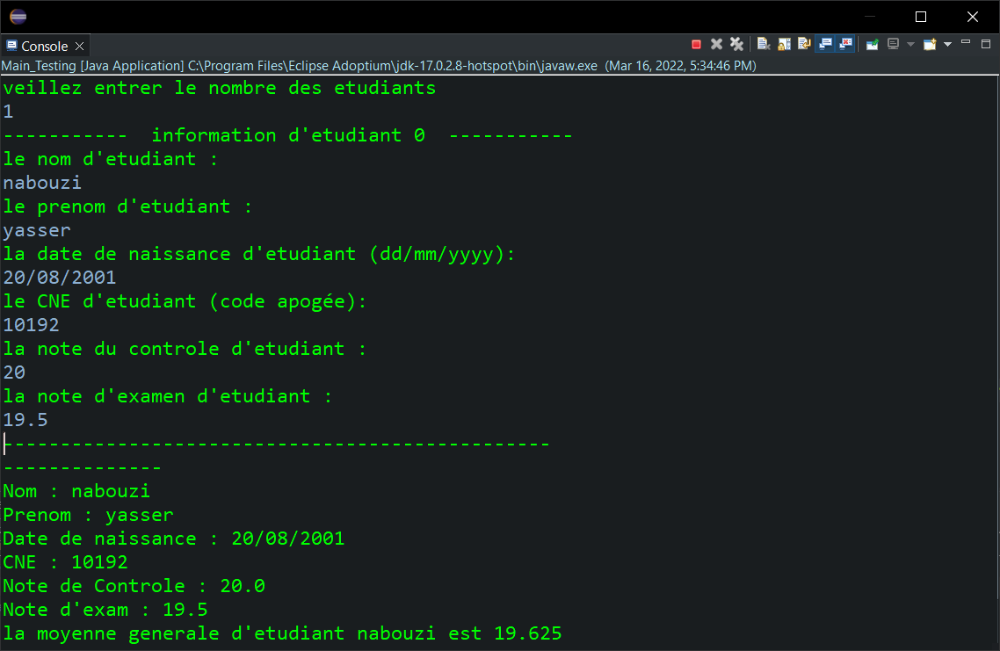
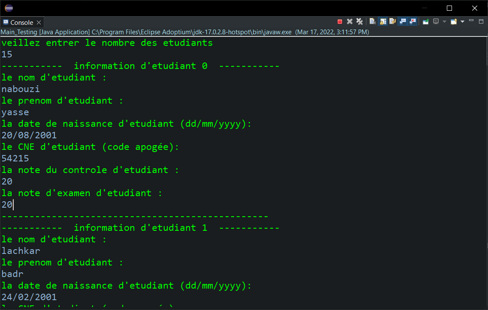
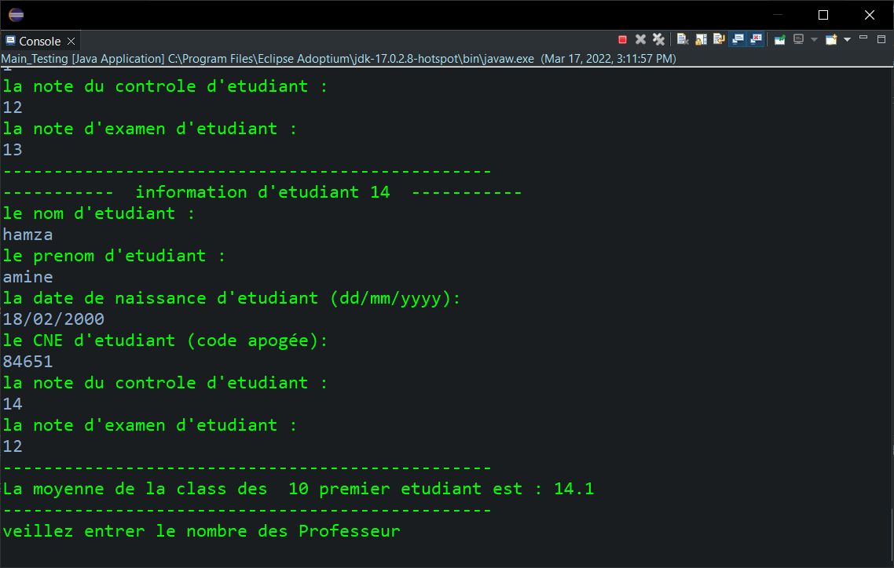
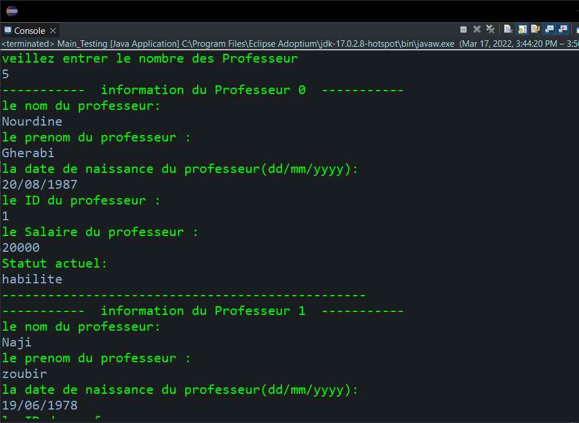
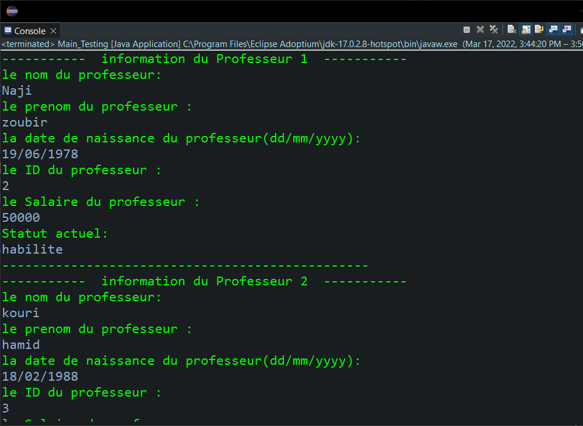
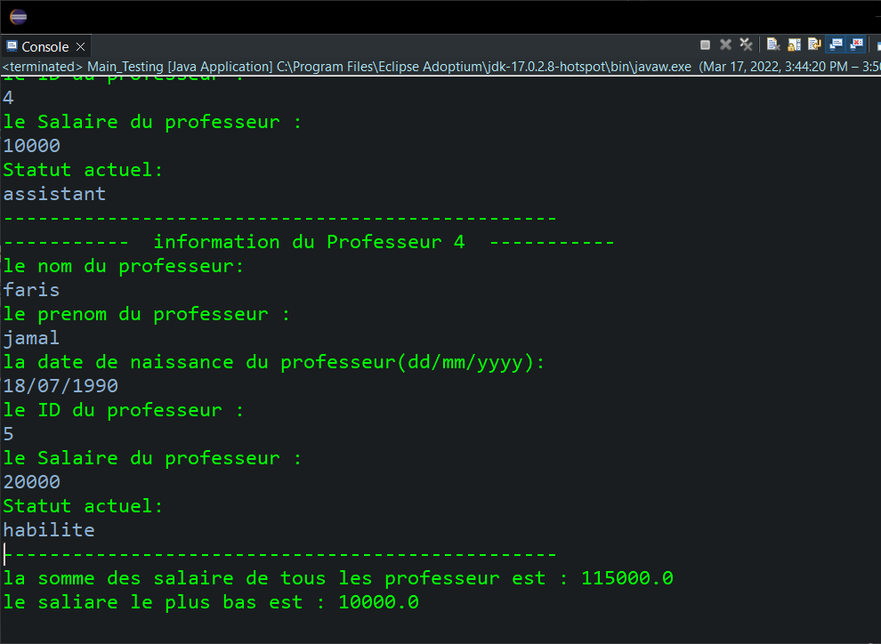

<div style="display:flex;justify-content:space-between">
    <div>
        <strong>
            Realise par :
        </strong>  
        <br>&nbsp;&nbsp;&nbsp;&nbsp;Yasser Nabouzi
        <br>&nbsp;&nbsp;&nbsp;&nbsp;Omar Lahbabi 
    </div>
    <div>
        <div>
            2021-2022
        </div>
        <div>
            
        </div>
    </div>
</div>
<br>
<div style="position:relative;bottom:51px">
    <strong>
        Filliere :
    </strong>  IID1
</div>
<div style = "text-align:center">
    <strong>
        Encadre par : 
    </strong>Noreddine GHERABI 
</div>
<div style="font-size:35px;font-weight:bold;text-align:center;">
    Rapport Des TPs Java
</div>

## TP3

### Q1 :
```java
public class Personne {

	String Nom;
	String Prenom;
	String DateN;
}   
```

### Q2 :

```java 
public Personne(String nom, String prenom, String dateN) {
		super();
		Nom = nom;
		Prenom = prenom;
		DateN = dateN;
}
```

### Q3 :

```java
public void affiche() {
	System.out.println("--------------"+"\nNom : "+Nom+"\nPrenom : "+Prenom+"\nDate de naissance : "+DateN);
}

```

### Q4:
- definissons la Classe __Etudiant__ et ses attributs  :
```java

public class Etudiant extends Personne {
	int CNE;
	float NoteConrole;
	float NoteExam;
}	
```
- definissons la Classe __Professeur__ et ses attributs  :
```java
public class Professeur extends Personne {
	int Profid;
	float Salaire;
	String Statut;
}
```
### Q5 :

- definissons le constructeur de la classe __Etudiant__ :

```java 
public Etudiant(String nom, String prenom, String dateN, int cne,float notecontrole,float noteexam) {
		super(nom, prenom, dateN);
		CNE = cne ;
		NoteConrole = notecontrole;
		NoteExam = noteexam;
}
```
- Methode afficher pour la classe __Etudiant__:

```java 
public void affiche() {
	super.affiche();
	System.out.println("CNE : "+CNE+"\nNote de Controle : "+NoteConrole+"\nNote d'exam : "+NoteExam);		
}
```
- definissons le constructeur de la classe Professeur :

```java
public Professeur(String nom, String prenom, String dateN,int profid,float salaire,String statut) {
	super(nom, prenom, dateN);
	Profid = profid;
	Salaire = salaire;
	Statut = statut;
}
```

- Methode afficher pour la classe __Professeur__:

```java
public void affiche() {
	super.affiche();
	System.out.println("Porf Id: "+Profid+"\nSalaire : "+Salaire+"\nStatut: "+Statut);	
}
```

### Q6 :

```java
public float CalcSalaire() {

    if (Statut.equalsIgnoreCase("assistant")) {
    	Salaire = Salaire+(Salaire*(float)0.2);
    }
    else if(Statut.equalsIgnoreCase("habilite")) {
    	Salaire = Salaire+(Salaire*(float)0.5);
    }
	return Salaire;
}
```


### Q7 :

```java
public float Moyenne() {
	float Moyenne = NoteExam * (float)0.75 +NoteConrole * (float)0.25;
	return Moyenne;
}
```

### Q8:
J'ai creer un fichier main qui va initialiser les tableau des Etudiants et Professeur afin  de  tester  les  méthodes  implémentées.
```java
import java.util.Scanner;
public class Main_Testing {
	static Scanner scan = new Scanner(System.in);
	public static void main(String[] args) {
		System.out.println("veillez entrer le nombre des etudiants");
		int n = Integer.parseInt(scan.nextLine());
		Etudiant [] E = new Etudiant[n];
		for (int i = 0 ; i<n ; i++) {
			System.out.println("-----------  "+"information d'etudiant "+i+"  -----------");
			E[i] = new Etudiant("", "", "", 0, 0, 0);
			System.out.println("le nom d'etudiant : ");
			E[i].Nom = scan.nextLine();
			System.out.println("le prenom d'etudiant : ");
			E[i].Prenom = scan.nextLine();
			System.out.println("la date de naissance d'etudiant (dd/mm/yyyy): ");
			E[i].DateN = scan.nextLine();
			System.out.println("le CNE d'etudiant (code apogée): ");
			E[i].CNE = Integer.parseInt(scan.nextLine());
			System.out.println("la note du controle d'etudiant : ");
			E[i].NoteConrole = Float.parseFloat(scan.nextLine());
			System.out.println("la note d'examen d'etudiant : ");
			E[i].NoteExam = Float.parseFloat(scan.nextLine());
			System.out.println("------------------------------------------------");
		}
		
		System.out.println("veillez entrer le nombre des Professeur");
		int m = Integer.parseInt(scan.nextLine());
		Professeur [] P = new Professeur[m];
		for (int i = 0 ; i<m ; i++) {
			System.out.println("-----------  "+"information du Professeur "+i+"  -----------");
			P[i] = new Professeur("", "", "", 0, 0, "");
			System.out.println("le nom du professeur: ");
			P[i].Nom = scan.nextLine();
			System.out.println("le prenom du professeur : ");
			P[i].Prenom = scan.nextLine();
			System.out.println("la date de naissance du professeur(dd/mm/yyyy): ");
			P[i].DateN = scan.nextLine();
			System.out.println("le ID du professeur : ");
			P[i].Profid = Integer.parseInt(scan.nextLine());
			System.out.println("le Salaire du professeur : ");
			P[i].Salaire = Float.parseFloat(scan.nextLine());
			System.out.println("Statut actuel: ");
			P[i].Statut= scan.nextLine();
			System.out.println("------------------------------------------------");
		}
	}

}

```

- Testons les methodes ```Affiche() et Moyenne():``` sur le premier etudiant : 
```java
E[0].affiche();
System.out.println("la moyenne generale d'etudiant "+E[0].Nom+" est "+E[0].Moyenne());
```
> Input / Output :


- Testons les methodes ```Affiche() et CalcSalaire():``` sur le premier Professeur : 

```java
P[0].affiche();
System.out.println("le salaire du professeur "+P[0].Nom+" est "+P[0].CalcSalaire());
```
> Input / Ouput :


### Q9 :
Creons une méthode statique pour calculer la moyenne generale d'une class.
```java 
static float CalcMoy(Etudiant [] E,int start,int end) {
		float s = 0;
		if (start >= 0 && end <= E.length) {
		for (int i = start ; i< end ;i++) {
			s = s + E[i].Moyenne();
		}
	}
		else {
			System.out.println("start or end out of range !!");
		}
		return s/end-start;
	}
```

### Q10:
Creons un tableau de 15 etudiant et remplissons ces informations :

> Input / Output :


### Q11 :
A l’aide de la méthode « CalMoy », Affichons la moyenne générale des 10 premiers étudiants.
```java 
System.out.println("La moyenne de la class des  10 premier etudiant est : "+CalcMoy(E,0,10));
System.out.println("------------------------------------------------");
```
> Input / Output :


### Q12 / 13 / 14:

```java
static float[] SumSalairemin(Professeur [] P) {
		float[] ans = new float[2];
		ans[0] = 0;
		ans[1] = P[0].Salaire;
		for (int i = 0; i < P.length; i++) {
			ans[0] = ans[0] + P[i].Salaire;
			ans[1] = ans[1] < P[i].Salaire ? ans[1] : P[i].Salaire;
		}
		return ans;
}
```
> Input / Output :
> 
> 
> 