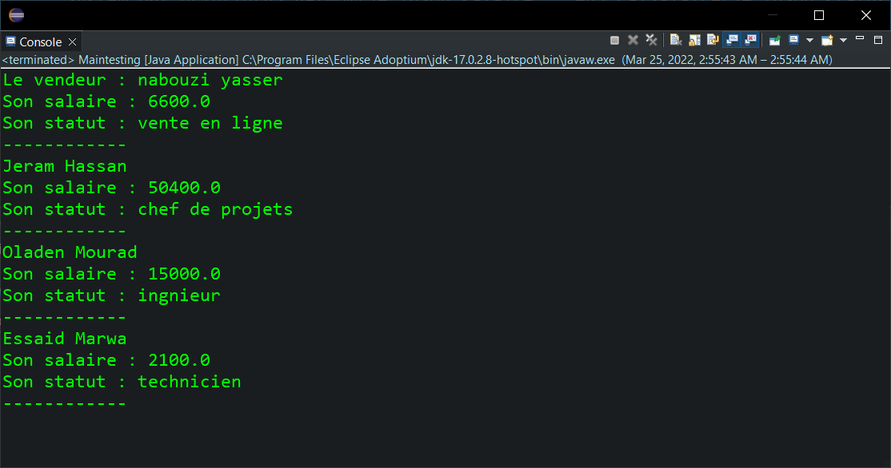
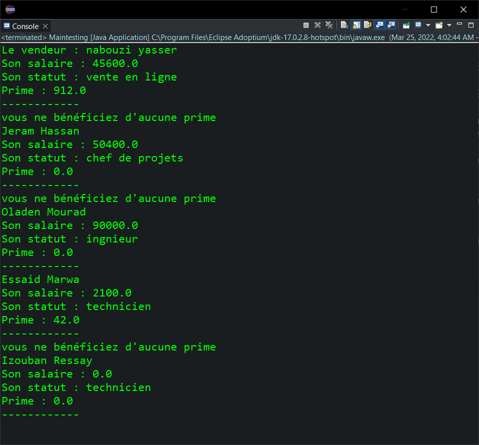

<div style="display:flex;justify-content:space-between">
    <div>
        <strong>
            Realise par :
        </strong>  
        <br>&nbsp;&nbsp;&nbsp;&nbsp;Yasser Nabouzi
        <br>&nbsp;&nbsp;&nbsp;&nbsp;Omar Lahbabi 
    </div>
    <div>
        <div>
            2021-2022
        </div>
        <div>
            
        </div>
    </div>
</div>
<br>
<div style="position:relative;bottom:51px">
    <strong>
        Filliere :
    </strong>  IID1
</div>
<div style = "text-align:center">
    <strong>
        Encadre par : 
    </strong>Noreddine GHERABI 
</div>
<div style="font-size:35px;font-weight:bold;text-align:center;">
    Rapport Des TPs Java
</div>

## Tp4
Pour ce TP, On souhaite de gérer le salaire des employés d’une société. Un employé est caractérisé par son nom, son prénom, son âge, son statut et sa date d'embauche.
On peut commencer par la creation de notre Class Employee et l'implementation des methode getters, setters et son constructeur qui prend comme parametre l'ensemble de ces attributs.

```java

public abstract class Employe {
	
	String Nom;
	String Prenom;
	int Age;
	String Statut;
	String DateDembauche;
	
	public Employe(String nom, String prenom, int age, String statut, String date) {
		super();
		Nom = nom;
		Prenom = prenom;
		Age = age;
		Statut = statut;
		DateDembauche = date;
	}

	abstract float CalSalaire();
	
	public String getNom() {
		return Nom + " " +Prenom;
	}
	public int getAge() {
		return Age;
	}	
}

```

## Partie I : Calcul des salaire

Le calcul du salaire mensuel dépend du statut de l’employé. On distingue deux types des employés (Les Vendeurs et les agents de production).
On commence par definir les class qui correspond pour chaque Employe puis,
on peut implementer le calcule pour chaque type d'employe par les relations suivantes :

- __Les Vendeur :__

  -  __vente en ligne__ 
    ```
    Salaire_VenteEnLigne = 0.3 x chiffre  d'affaire + 600
    ```
  -  __vente directe__

  ```
  Salaire_VenteDirecte = 0.25 x chiffre  d'affaire + 750
  ```
__Partie Code__
```java

public class Vendeur extends Employe{
	float ChiffreDaff;
	
	public Vendeur(String nom, String prenom, int age, String statut, String datedembauche,float chiffreDaff) {
		super(nom, prenom, age, statut, datedembauche);ChiffreDaff = chiffreDaff;
	}
	
	public String getNom() {
		return "Le vendeur : "+super.getNom();
	};
	
	float CalSalaire() {
		float s = 0;
		if (Statut.equalsIgnoreCase("vente en ligne")) {
			s = 0.3f*ChiffreDaff+600f; 
		}
		else if (Statut.equalsIgnoreCase("vente directe")) {
			s = 0.25f*ChiffreDaff+750f;
		}
		else {
			System.out.println("Error valeur entrer introuvable (Vente en ligne / Vente directe)");
		}
		return s;
	}
}
```


- __Agent :__

    -  __chefs  de  projets__
    ```
    Salaire_ChefsDeProjects = NbrProject*5000 +400f;
    ```
    -   __ingénieurs__
    ```
    Salaire_Ingenieur = NbrHeur*300;
    ```
    - __techniciens__
    ```
    Salaire_Techniciens = NbrUnite*70;
    ```
__Partie code :__

```java

public class Agent extends Employe{
	
	int NbrProject = 0,NbrHeur = 0,NbrUnite = 0;
	public Agent(String nom, String prenom, int age, String statut, String datedembauche,int nbrporject,int nbrheur,int nbrunite) {
		super(nom, prenom, age, statut, datedembauche);NbrProject = nbrporject;NbrHeur= nbrheur;NbrUnite = nbrunite;
	}
	
	float CalSalaire() {
		float s = 0;
		if (Statut.equalsIgnoreCase("chef de projets")){
			s = NbrProject*5000 +400f; 
		}
		else if (Statut.equalsIgnoreCase("ingnieur")) {
			s = NbrHeur*300;
		}
		else if (Statut.equalsIgnoreCase("technicien")){
			s = NbrUnite*70;
		}
		else{
			System.out.println("Error valeur entrer introuvable (chef de projets/ ingenieur/ technicien)");
		}	
		return s;
	}
}
```

On peut initialiser quelque type d'employe pour tester le bon fonctionnement des methodes:

```java

public class Maintesting {

	public static void main(String[] args) {
		Vendeur V = new Vendeur("nabouzi", "yasser", 20, "vente en ligne","20/10/2019" , 20000);
		System.out.println(V.getNom()+"\nSon salaire : "+V.CalSalaire()+"\nSon statut : "+V.Statut+"\n------------");
		Agent A1 = new Agent("Jeram", "Hassan", 25, "chef de projets","21/07/2011", 10, 0, 0);
		System.out.println(A1.getNom()+"\nSon salaire : "+A1.CalSalaire()+"\nSon statut : "+A1.Statut+"\n------------");
		Agent A2 = new Agent("Oladen", "Mourad", 40, "ingnieur","04/02/2008", 0, 50, 0);
		System.out.println(A2.getNom()+"\nSon salaire : "+A2.CalSalaire()+"\nSon statut : "+A2.Statut+"\n------------");
		Agent A3 = new Agent("Essaid", "Marwa", 20, "technicien","20/04/2018", 0, 0, 30);
		System.out.println(A3.getNom()+"\nSon salaire : "+A3.CalSalaire()+"\nSon statut : "+A3.Statut+"\n------------");
}
}
```
> Input / Output :
> 


## Partie II : Calcul des primes

Ajoutons une interface « Salarie » contenant  les méthodes de calcul des primes selon le type de l’employé (Vendeur ou Technicien).
Creons d'abords une interface __Salarie__.
```java
public interface Salarie {
	public float CalcPrime(float salaire);; 
}
```
Puis on l'implement dans les classes de vendeurs et techniciens.
- Pour les __Vendeurs__ :
```java
public class Vendeur extends Employe implements Salarie{
    .
    ..
    ...

    @Override
	public float CalcPrime(float salaire) {
		float prime = 0;
		if (ChiffreDaff > 50000) {
			prime = salaire * 0.02f; 
		}
		else if(ChiffreDaff > 100000) {
			prime = salaire * 0.05f;
		}
		return prime;
	}
}
```

- Pour les technicien:
```java
public class Agent extends Employe implements Salarie{
    .
    ..
    ...

    @Override
	public float CalcPrime(float salaire) {
		float prime = 0;
		if (Statut.equals("technicien") && NbrHeur > 240) {
				prime = salaire * 0.02f;
		}
		else {
			System.out.println("vous ne bénéficiez d'aucune prime");
		}
		return prime;
	}
}
```
Il reste just de tester nos nouveaux interfaces et dans un main class.

```java

public class Maintesting {
	
	public static void main(String[] args) {
		// instantiation d'un vendeur
		Vendeur V = new Vendeur("nabouzi", "yasser", 20, "vente en ligne","20/10/2019" , 150000);
		// affichons les informations principales avec son salaire et son prime calculer a l'aide des interface
		System.out.println(V.getNom()+"\nSon salaire : "+V.CalSalaire()+"\nSon statut : "+V.Statut+"\nPrime : "+V.CalcPrime(V.CalSalaire())+"\n------------");
		// affichons les informations principales et testons si les primes peut se calculer seulement pour les technicien.
		Agent A1 = new Agent("Jeram", "Hassan", 25, "chef de projets","21/07/2011", 10, 0, 0);
		System.out.println(A1.getNom()+"\nSon salaire : "+A1.CalSalaire()+"\nSon statut : "+A1.Statut+"\nPrime : "+A1.CalcPrime(A1.CalSalaire())+"\n------------");
		Agent A2 = new Agent("Oladen", "Mourad", 40, "ingnieur","04/02/2008", 0, 300, 0);
		System.out.println(A2.getNom()+"\nSon salaire : "+A2.CalSalaire()+"\nSon statut : "+A2.Statut+"\nPrime : "+A2.CalcPrime(A2.CalSalaire())+"\n------------");
		// testons pour un technicien qui a un nombre d'heurs superieur a 240
		Agent A3 = new Agent("Essaid", "Marwa", 20, "technicien","20/04/2018", 0, 500, 30);
		System.out.println(A3.getNom()+"\nSon salaire : "+A3.CalSalaire()+"\nSon statut : "+A3.Statut+"\nPrime : "+A3.CalcPrime(A3.CalSalaire())+"\n------------");
		// testons pour un technicien qui a un nombre d'heurs inferieur a 240
		Agent A4 = new Agent("Izouban", "Ressay", 48, "technicien","04/02/2017", 0, 210, 0);
		System.out.println(A4.getNom()+"\nSon salaire : "+A4.CalSalaire()+"\nSon statut : "+A4.Statut+"\nPrime : "+A4.CalcPrime(A4.CalSalaire())+"\n------------");
	}
}
```

> Input / Output :
> 