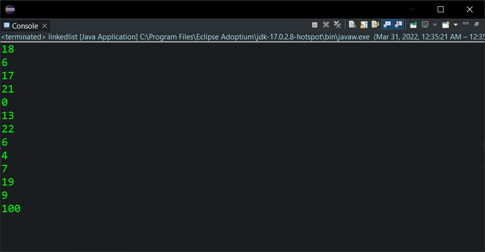

<div style="display:flex;justify-content:space-between">
    <div>
        <strong>
            Realise par :
        </strong>  
        <br>&nbsp;&nbsp;&nbsp;&nbsp;Yasser Nabouzi
        <br>&nbsp;&nbsp;&nbsp;&nbsp;Omar Lahbabi 
    </div>
    <div>
        <div>
            2021-2022
        </div>
        <div>
            
        </div>
    </div>
</div>
<br>
<div style="position:relative;bottom:51px">
    <strong>
        Filliere :
    </strong>  IID1
</div>
<div style = "text-align:center">
    <strong>
        Encadre par : 
    </strong>Noreddine GHERABI 
</div>
<div style="font-size:35px;font-weight:bold;text-align:center;">
    Rapport Des TPs Java
</div>


## Tp5
### Exo1:
#### Qst 1 :
```java
public class Personne {
	private int code;
	private String nom;
	private String prenom;
}
```

#### Qst 2 :

```java
public int getCode() {
		return code;
	}
public void setCode(int code) {
    this.code = code;
}
public String getnom() {
    return nom;
}
public void setnom(String nom) {
    this.nom = nom;
}
public String getPrenom() {
    return prenom;
}
public void setPrenom(String prenom) {
    this.prenom = prenom;
}
```

#### Qst 3 :

```java
public Personne(int code, String nom, String prenom) {
		super();
		this.code = code;
		this.nom = nom;
		this.prenom = prenom;
	}
```

#### Qst 4 :
```java
public String toString() {
		return "\n Personne [code = " + code + ", nom = " + nom + ", prenom = " + prenom + "]";
	}
```

#### Qst 5 :

```java
import java.util.List;

public interface IPerson {
	void save(Personne p);
	void delete(int code);
	boolean update(Personne p);
	Personne findById(int code);
	List<Personne>findAll();
}
```


#### Qst 6 :
```java
import java.util.ArrayList;
import java.util.List;
import java.util.Scanner;

public class PersonneService implements IPerson {
	
	ArrayList<Personne> salle;

	public PersonneService(ArrayList<Personne> salle) {
		super();
		this.salle = salle;
	}
	public void save(Personne p) {
		this.salle.add(p);
	}
	public void delete(int code) {
		if(salle.remove(findById(code))) {
			System.out.println("personne bien supprimer !");
		}else{
			System.out.println("personne non trouver");
		};
	}
	public void update(Personne p) {
		Scanner scan = new Scanner(System.in);
		System.out.println("Quelle person voullez vous modifier ? ");
		int code = scan.nextInt();
		this.salle.remove(findById(code));
		this.salle.add(p);	
	}
	public Personne findById(int code) {
		Personne SearchedPerson = new Personne();
		for(Personne i : salle) {
			if(i.getCode() == code)
				SearchedPerson = i;
		}
		return SearchedPerson;
	}
	public List<Personne> findAll() {
		return salle;
	}
}
```

#### Qst 7 :
```java
import java.util.ArrayList;


public class Test {

	public static void main(String[] args) {
		// Créer cinq personnes. 
		Personne p1 = new Personne(1245, "Omar", "Lehbabi");
		Personne p2 = new Personne(2004, "Yasser", "Nabouzi");
		Personne p3 = new Personne(1200, "Hamid", "Boutaleb");
		Personne p4 = new Personne(1955, "Halima", "Loumni");
		Personne p5 = new Personne(4005, "Oumaima", "Karine");
		Personne p6 = new Personne(5487, "Rida", "Louham");

		ArrayList<Personne> C1 = new ArrayList<Personne>();
		PersonneService CC = new PersonneService(C1);
		CC.save(p1);
		CC.save(p2);
		CC.save(p3);
		CC.save(p4);
		CC.save(p5);
		// Afficher la liste des personnes.
		System.out.println("Afficher la liste des personnes");
		System.out.println(CC.findAll());
		System.out.println("\n---------------------------------------");
		// Supprimer une personne.
		System.out.println("Supprimer une personne");
		CC.delete(1200);
		System.out.println("\n---------------------------------------");
		// Modifier les informations d'une personne
		System.out.println("Modifier les informations d'une personne");
		CC.update(p6);
		System.out.println("\n---------------------------------------");
		// Rechercher une personne par son code.
		System.out.println("Rechercher une personne par son code");
		System.out.println(CC.findById(1955));
		System.out.println("\n---------------------------------------");
		// Afficher à nouveau la liste des personnes 
		System.out.println("Afficher à nouveau la liste des personnes ");
		System.out.println(CC.findAll());	
	}
}
```

> Input / Ouput :
> 

### Exo2:

#### Qst 1 :
```java
public class linkedlist {
    public static void main(String[] args) {
        Random rand = new Random();
        List<Integer> liste1 = new LinkedList<>();      //creation de la liste
        for (int i=0; i<10; i++)   //remplissage de la liste avec 10 nombre aleatoires
            liste1.add(rand.nextInt(25));
}
```
> Input / Ouput :
> 

#### Qst 2 :
```java
liste1.add(3, 0);       //ajout d'un nombre a un indice choisi(3 par exemple c-a-d 4eme position)
```
> Input / Ouput :
> 

#### Qst 3 :
```java
liste1.add(0,18);       //ajout d'un element a la premiere position
System.out.println(liste1);
liste1.add(liste1.size(),100);  //ajout d'un element a la derniere position
System.out.println(liste1);
```
> Input / Ouput :
> 

#### Qst 4 :
```java
Iterator<Integer> itr = liste1.iterator();
    while (itr.hasNext()) {
        int i = itr.next();
        System.out.print(i + " ");
    }
```
> Input / Ouput :
> 

#### Qst 5 :
```java
for (int i=0; i < liste1.size(); i++)
    {
        System.out.println(liste1.get(i));
    }
```

> Input / Ouput :
> 

#### Qst 6 :
```java
System.out.println(liste1.get(0));  //affichage du premier element
System.out.println(liste1.get(liste1.size() - 1));  //affichage du dernier element
```
> Input / Ouput :
> 

#### Qst 7 :
```java
liste1.remove(4);       //supression d'un element de la liste
```

> Input / Ouput :
> 

#### Qst 8 :
```java
System.out.println("liste 1 : "+liste1);
List<Integer> liste2 = new LinkedList<>();      //creation de la liste2
for (int i=liste1.size()-1; i >= 0; i--)
{
    liste2.add(liste1.get(i));
}
System.out.println("liste 2 : "+liste2);
```

> Input / Ouput :
> 