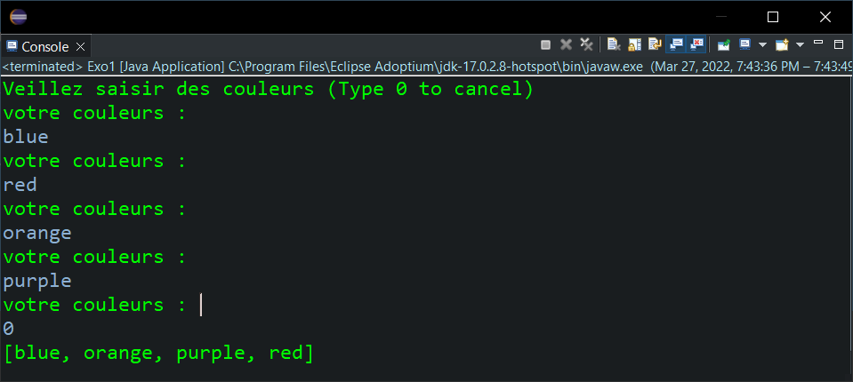
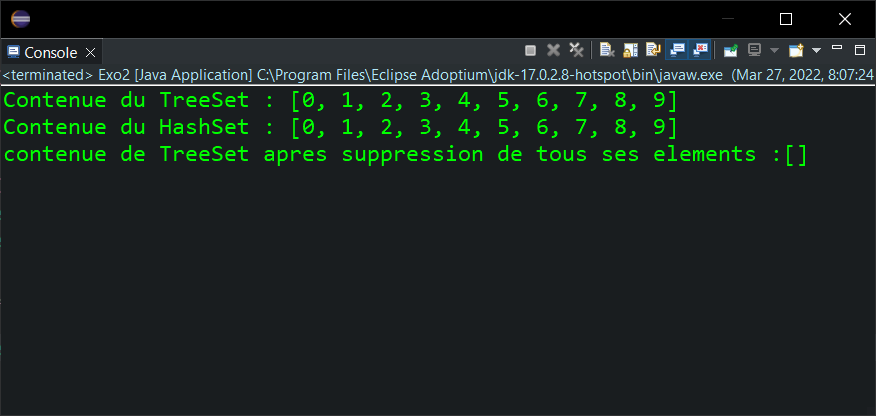
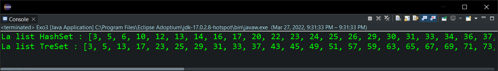
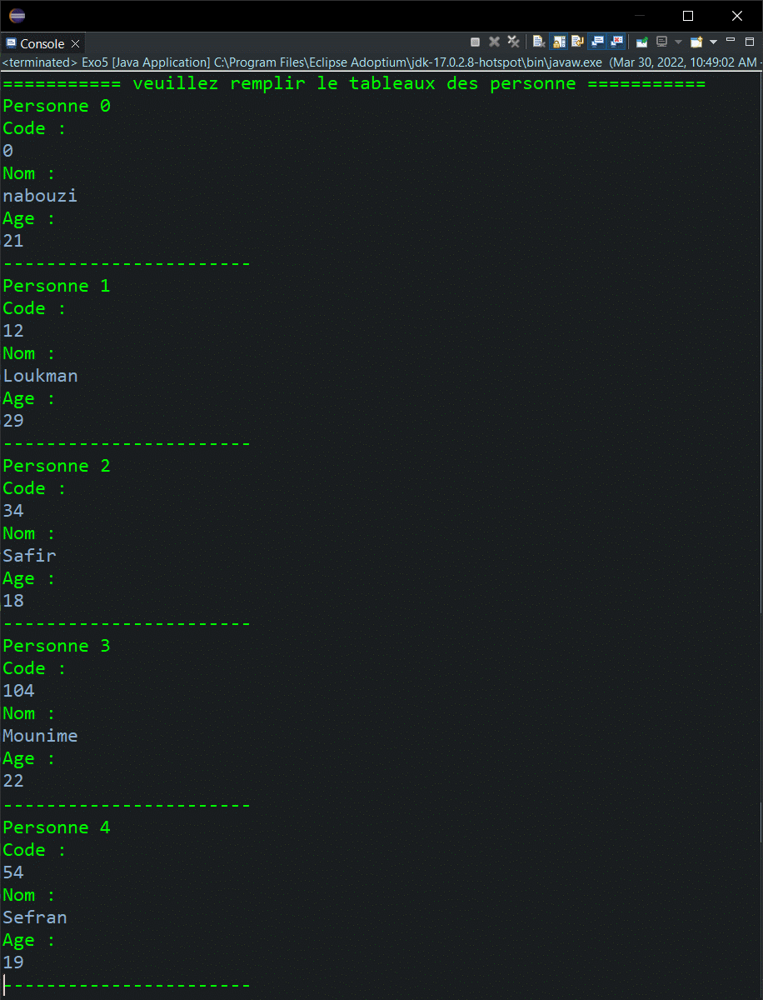
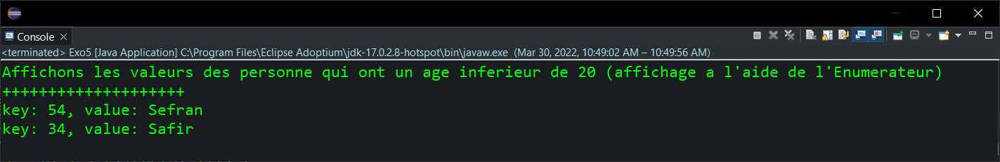
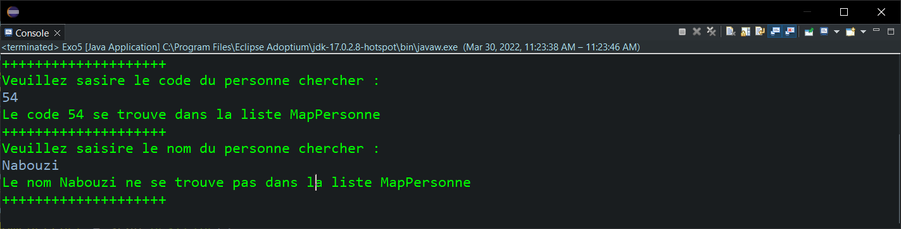
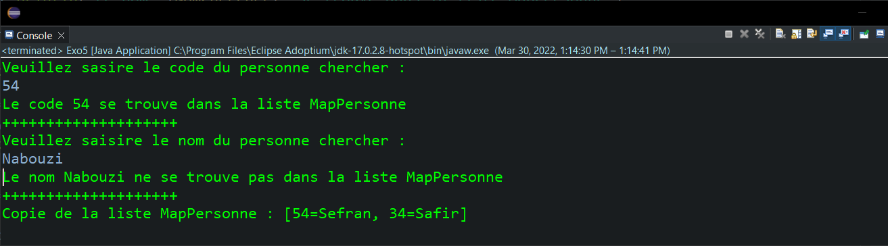
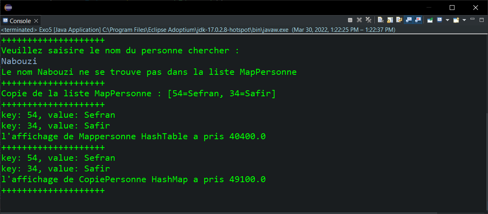

<div style="display:flex;justify-content:space-between">
    <div>
        <strong>
            Realise par :
        </strong>  
        <br>&nbsp;&nbsp;&nbsp;&nbsp;Yasser Nabouzi
        <br>&nbsp;&nbsp;&nbsp;&nbsp;Omar Lahbabi 
    </div>
    <div>
        <div>
            2021-2022
        </div>
        <div>
            
        </div>
    </div>
</div>
<br>
<div style="position:relative;bottom:51px">
    <strong>
        Filliere :
    </strong>  IID1
</div>
<div style = "text-align:center">
    <strong>
        Encadre par : 
    </strong>Noreddine GHERABI 
</div>
<div style="font-size:35px;font-weight:bold;text-align:center;">
    Rapport Des TPs Java
</div>


## Tp6
### Exo1:
Écrivons un programme Java permet de créer une liste « TreeSet » et ajoutez des couleurs (chaîne) dans la liste.

```java
import java.util.List;
import java.util.TreeSet;
import java.util.Scanner;
public class Exo1 {
	static Scanner scan = new Scanner(System.in);
	public static void main(String[] args) {
		String col;
		TreeSet list1 = new TreeSet();
		System.out.println("Veillez saisir des couleurs (Type 0 to cancel)");
		do {
			System.out.println("votre couleurs : ");
			col = scan.nextLine();
			if (col.equals("0") == false) {
				list1.add(col);
					};
		}while(col.equals("0") == false);
		System.out.println(list1);
	}
}
```

> Input/Ouput:
> 

### Exo2:
Écrivons un programme Java qui  ajoute tous les éléments d'une liste de type 
« TreeSet » dans une autre liste de type « HashSet ».

```java
import java.util.HashSet;
import java.util.TreeSet;

public class Exo2 {
	public static void main(String[] args) {
		TreeSet<Integer> list1 = new TreeSet<Integer>();
		for (int i = 0; i < 10; i++) {
			list1.add(i);
		}
		HashSet<Integer> list2 = new HashSet<Integer>(list1);
		System.out.println("Contenue du TreeSet : " + list1);
		System.out.println("Contenue du HashSet : " + list2);
		// supression de tous les element du la list TreeSet
		list1.clear();
		System.out.println("contenue de TreeSet apres suppression de tous ses elements :"+list1);
	}
}
```

> Input / Output :
> 


### Exo3:
Écrivons un programme Java permettant de créer une liste ordonnée qui contient 
juste les entiers impairs d’une autre liste de type « HashSet » 

```java
import java.util.HashSet;
import java.util.Iterator;
import java.util.Random;
import java.util.TreeSet;

public class Exo3 {
	
	public static void main(String[] args) {
		Random rand = new Random(); // Utilisons le random fonction pour avoir des nombres aleatoire afin de les ordonnes.
		TreeSet<Integer> list1 = new TreeSet<Integer>(); // utilisons un TreeSet pour son trie automatique
		HashSet<Integer> list2 = new HashSet<Integer>(); // hashset pour stocker des nombre entier car il sont plus rapide
		// Remplissons notre Hashset 
		for (int i = 0; i < 100; i++) {
			list2.add(rand.nextInt(100));
		}
		// initialisons un iterateur 
		Iterator<Integer> it = list2.iterator();
		while (it.hasNext()) {
			int elt = it.next();
			if (elt%2!=0) { // tester la parite
				list1.add(elt);
			}
		}
		System.out.println("La list HashSet : "+list2);
		System.out.println("La list TreSet : "list1);
	}
}
```



### Exo4:

```java
import java.util.HashSet;
import java.util.Iterator;
import java.util.TreeSet;
import java.util.LinkedHashSet;


public class Exo4 {
	// Creation de la class Voiture
	static public class Voiture implements Comparable<Voiture>{
		String Matricule;
		String Marque;
		int Puissance;
		
		public Voiture(String matricule, String marque, int puissance) {
			super();
			Matricule = matricule;
			Marque = marque;
			Puissance = puissance;
		}
		public String toString() {
			return "Marque : "+Marque+"\nMatricule : "+Matricule+"\nPuissance : "+Puissance+"\n----------------";
		}
		// implementent un comperateur pour odonner la liste treeset
		@Override
		public int compareTo(Exo4.Voiture o) {
			// ordonner de facons decroissant
			if (this.Puissance < o.Puissance) {
				return 1;
			}else {
			return -1;
			}
		}
	}
	

	public static void main(String[] args) {
		// 1) Creation de la list HashSet qui contient des objects de la class voiture
		HashSet<Voiture> list1 = new HashSet<Voiture>();
		list1.add(new Voiture("A1871", "Dacia", 200));
		list1.add(new Voiture("D6487", "Ferrari", 700));
		list1.add(new Voiture("I9846", "Tesla", 500));
		list1.add(new Voiture("V7465", "Porshe", 900));
		Iterator<Voiture> it1 = list1.iterator();
		System.out.println("==============Contenue de Hashset :==============");
		// 3) Calculons le temps d'affichage du Hashset
		double t1 = System.nanoTime();
		while (it1.hasNext()) {
			Voiture tmp = (Voiture) it1.next();
			System.out.println(tmp.toString());
		};
		double t2 = System.nanoTime();
		System.out.println("*** la HashSet a pris : "+(t2-t1));
		// 2) Copions la liste creer dans une TreeSet
		TreeSet<Voiture> list2 = new TreeSet<Voiture>(list1);
		System.out.println("==============Contenue de TreeSet : ==============");
		Iterator<Voiture> it2 = list2.iterator();
		// 3) Calculons le temps d'affichage du Treeset
		t1 = System.nanoTime();
		while (it2.hasNext()) {
			Voiture tmp = (Voiture) it2.next();
			System.out.println(tmp.toString());
		};
		t2 = System.nanoTime();
		System.out.println("*** la HashSet a pris : "+(t2-t1));
		
		// 4) Mettons les objets des deux listes dans une troisième liste « ListeLinked » de type « LinkedHashSet »
		LinkedHashSet<Voiture> list3 = new LinkedHashSet<Voiture>();
		list3.addAll(list2);
		System.out.println("==============Contenue de Linked Hash Set : ==============");
		Iterator<Voiture> it3 = list2.iterator();
		t1 = System.nanoTime();
		while (it3.hasNext()) {
			Voiture tmp = (Voiture) it3.next();
			System.out.println(tmp.toString());
		};
		// Transformons la liste en un tableau.
		System.out.println("==============Contenue de tableau : ==============");
		Object[] v = list3.toArray();
		for(int i = 0 ; i < v.length; i++) {
			System.out.println(v[i].toString());
			};
		}	
}
```

> Input / Ouput :
> 
> 


### Exo 5 :


```java
import java.util.Iterator;
import java.util.Scanner;
import java.util.ArrayList;
import java.util.Hashtable;
public class Exo5 {
	static public class Personne{
		int Code,Age;
		String Nom;
		public Personne(int code, String nom, int age) {
			super();
			Code = code;
			Nom = nom;
			Age = age;
		}
		public Personne() {
		Age = Code = 0;
		Nom = "";
		};
		public String toString() {
			return "Code : "+Code+"\nNom : "+Nom+"\nAge : "+Age;
		};
		
	}
	public static void main(String[] args) {
		Scanner scan = new Scanner(System.in);
		Personne[] P = new Personne[5];
		System.out.println("=========== veuillez remplir le tableaux des personne ===========");
		for (int i = 0; i < P.length; i++) {
			System.out.println("Personne "+i);
			P[i] = new Personne();
			System.out.println("Code : ");
			P[i].Code = Integer.parseInt(scan.nextLine());
			System.out.println("Nom : ");
			P[i].Nom = scan.nextLine();
			System.out.println("Age : ");
			P[i].Age = Integer.parseInt(scan.nextLine());
			System.out.println("-----------------------");
		}
```
#### Q1 :
Ecrivons un code java permettant d’extraire les éléments du tableau selon l’âge de la personne.

```java
		// ******* Qst 1 ******* 
ArrayList<String> ListeNom = new ArrayList<String>();
Hashtable<Integer, String> MapPersonne = new Hashtable<Integer, String>();
for (int i = 0; i < P.length; i++) {
	if (P[i].Age >= 20) {
		ListeNom.add(P[i].Nom);
	}else {
		MapPersonne.put(P[i].Code,P[i].Nom);
	}
}
```

> Input / Ouput :
> 

#### Q2 :
```java
Iterator<String> it = ListeNom.iterator();
		System.out.println("les noms des personne qui ont un age superieur de 20");
		while (it.hasNext()) {
			String tmp = it.next();
			System.out.println(it);
}
```
> Input / Output :
> 


#### Q3 :
```java
System.out.println("Affichons les valeurs des personne qui ont un age inferieur de 20 (affichage a l'aide de l'Enumerateur)\n++++++++++++++++++++");
final Enumeration<Integer> e = Collections.enumeration(MapPersonne.keySet());
while(e.hasMoreElements())
{      Integer key=e.nextElement();
		String value = MapPersonne.get( key );
		System.out.println("key: " + key + ", value: " + value);
}
```

> Input / Ouput :
> 

#### Q4 et Q5 :

```java
System.out.println("Veuillez sasire le code du personne chercher : ");
int CodeChercher = Integer.parseInt(scan.nextLine());
if (MapPersonne.containsKey(CodeChercher)) {
	System.out.println("Le code "+CodeChercher+"se trouve dans la liste MapPersonne");
}else {
	System.out.println("Le code "+CodeChercher+"ne se trouve pas dans la liste MapPersonne");
}
System.out.println("++++++++++++++++++++");
```

```java
System.out.println("Veuillez saisire le nom du personne chercher :");
String NomChercher = scan.nextLine();
if (MapPersonne.contains(NomChercher)) {
	System.out.println("Le Nom "+NomChercher+"se trouve dans la liste MapPersonne");
}else {
	System.out.println("Le Nom "+NomChercher+"ne se trouve pas dans la liste MapPersonne");
}	
System.out.println("++++++++++++++++++++");
```

> Input / Output  :
> Pour Q4 et Q5, on peut voir le resultat des deux cas 
> 


#### Q6 / Q7 :
```java
HashMap<Integer, String> CopiePersonne = new HashMap<Integer, String>(MapPersonne);
System.out.println("Copie de la liste MapPersonne : "+CopiePersonne.entrySet());
System.out.println("++++++++++++++++++++");
```

> Input / Ouput :
> 

#### Q8 :

```java
final Enumeration<Integer> a = Collections.enumeration(MapPersonne.keySet());
double t2 = System.nanoTime();
while(a.hasMoreElements())
{      Integer key=a.nextElement();
		String value = MapPersonne.get( key );
		System.out.println("key: " + key + ", value: " + value);
}
double t1 = System.nanoTime();
System.out.println("l'affichage de Mappersonne HashTable a pris "+(t1-t2));
System.out.println("++++++++++++++++++++");

// ****************************************************************************

final Enumeration<Integer> b = Collections.enumeration(CopiePersonne.keySet());
t2 = System.nanoTime();
while(b.hasMoreElements())
{      Integer key=b.nextElement();
		String value = CopiePersonne.get( key );
		System.out.println("key: " + key + ", value: " + value);
}
t1 = System.nanoTime();
System.out.println("l'affichage de CopiePersonne HashMap a pris "+(t1-t2));
System.out.println("++++++++++++++++++++");
```

> Input / Ouput :
> 