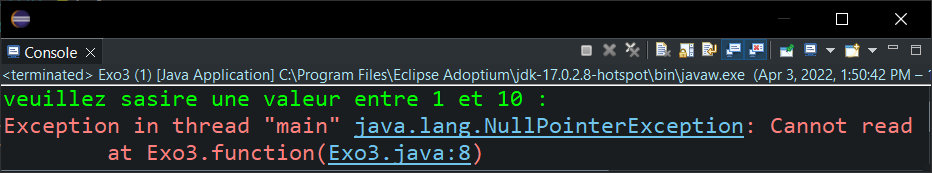

<div style="display:flex;justify-content:space-between">
    <div>
        <strong>
            Realise par :
        </strong>  
        <br>&nbsp;&nbsp;&nbsp;&nbsp;Yasser Nabouzi
        <br>&nbsp;&nbsp;&nbsp;&nbsp;Omar Lahbabi 
    </div>
    <div>
        <div>
            2021-2022
        </div>
        <div>
            
        </div>
    </div>
</div>
<br>
<div style="position:relative;bottom:51px">
    <strong>
        Filliere :
    </strong>  IID1
</div>
<div style = "text-align:center">
    <strong>
        Encadre par : 
    </strong>Noreddine GHERABI 
</div>
<div style="font-size:35px;font-weight:bold;text-align:center;">
    Rapport Des TPs Java
</div>


## Tp7
### Exo1:

#### Q1:

```java
public class Entier {
	int A;
	public Entier(int a) {
		super();
		A = a;
	}
}
```
#### Q2 :
Dans la class Entier:
```java
	double Divison(Entier E) {				
		return this.A/E.A;
	}
```
#### Q3:

```java
public class MainTesting {

	public static void main(String[] args) {
		// *********** Qst 3 *********** 
		Entier dividende = new Entier(5);
		Entier diviseur1 = new Entier(2);
		Entier diviseur2 = new Entier(5);
		Entier diviseur3 = new Entier(0);
		System.out.println("la premier division de "+dividende.A+" par "+diviseur1.A+" est : "+dividende.Divison(diviseur1));
		System.out.println("la deuxieme division de "+dividende.A+" par "+diviseur2.A+" est : "+dividende.Divison(diviseur2));
		System.out.println("la Troisieme division de "+dividende.A+" par "+diviseur3.A+" est : "+dividende.Divison(diviseur3));	
	}
}

```

> Input / Output :
> 

On peut voir que pour le test des entiers 2 et 5, On a eu aucun le resultat sans problem sauf pour le 0 qui a retourner un erreur de division par Zero.

La methode Division declenche un erreur ArithmeticException qui interdit la division d'un nombre par zero, d'ou le programme s'arrete des le declenchement de l'erreur.

#### Q4:

```java
double Divison(Entier E) {
   double res = 0;
	try {
		res = this.A/E.A;			
	} catch (Exception e2) {
		System.out.println("Division impossible.");
	}
	return res;
}
```

> Input / Ouput :
> 


### Exo 2 : 
#### Qst 1 :
```java
static public double Fact(int n) {	
    if (n == 0 || n == 1) {
        return 1;
    }
    return n * Fact(n-1);
} 
```

#### Qst 2 :
```java
import java.util.Scanner;

public class Exo2 {
	// ************* Qst 1 *************
	static public double Fact(int n) {
		if (n == 0 || n == 1) {
			return 1;
		}
		return n * Fact(n-1);
	} 
```

- Passons un Character :
> Input / Output :
> 
- Passons un nombre reel:
> Input / Output :
> 
#### Qst 3 :
```java
Scanner scan = new Scanner(System.in);
System.out.println("Donner un entier positive pour calculer son factoriel : ");
try {
int n = scan.nextInt();
if (n < 0) {
	System.out.println("Resultat : "+(-Fact(n)));	
}else {
	System.out.println("Resultat : "+Fact(n));			
}		
} catch (Exception inputException) {
System.out.println("Input is not an Integer!! ");
}
```
> Input / Output :
> 

```java
System.out.println("Donner un entier positive pour calculer son factoriel : ");
	try {
		int n = scan.nextInt();
		if (n < 0) {
			System.out.println("Resultat : "+(-Fact(n)));	
		}else {
			System.out.println("Resultat : "+Fact(n));		
		}
	} catch (Exception e) {
		throw new NotAnInt();			
	} finally {
		System.out.println("fun de calcul");	}	
	}
```
> Input / Output :
> 

### Exo 3 :

#### Qst 1 :

```java
import java.util.Scanner;
public class Exo3 {
	static Scanner scan = new Scanner(System.in);
	static public int function(int n) throws NumberIslessThan1, NumberOutOfBound {
		System.out.println("veuillez sasire une valeur entre 1 et "+n+" : ");
		int a = 0;
		try {
			a = Integer.parseInt(scan.nextLine());
			if (a<=1) {
				throw new NumberIslessThan1();
			}else if(a > n) {
				throw new NumberOutOfBound(n);
			}
			
		} catch (Exception e) {
			System.out.println("Input in not an int!!");
		}
		return a;			
	}
	public static void main(String[] args) throws NumberIslessThan1, NumberOutOfBound {
		function(10);
	}
}

```
- Exception n inferieur a 1:
```java 
public class NumberIslessThan1 extends Exception {
	public NumberIslessThan1() {
		System.out.println("Nombre inferieur a 1");
	}
}
```
- Exception nombre out of bound :

```java
public class NumberOutOfBound extends Exception {
	public NumberOutOfBound(int n) {
		System.out.println("valeur entrer n'est pas comprise entre 1 et "+n);
	}
}
```


> Input / Output :
> 
> 
> 
> 


#### Qst 2 / Qst 3 :
```java
import java.util.Scanner;
public class Exo3 {
	static Scanner scan = new Scanner(System.in);
	static public int function(int n,int[] t) throws NumberIslessThan1, NumberOutOfBound {
		System.out.println("veuillez sasire une valeur entre 1 et "+n+" : ");
		int a = t.length; // < ---- Prend la taille du tableau comme entre
		try {
			a = Integer.parseInt(scan.nextLine());
			if (a<=1) {
				throw new NumberIslessThan1();
			}else if(a > n) {
				throw new NumberOutOfBound(n);
			}
			
		} catch (NumberFormatException e) {
			System.out.println("Input in not an int!!");
		}
		return a;			
	}
	public static void main(String[] args) throws NumberIslessThan1, NumberOutOfBound {
		int [] t = null;
 		function(10,t);
	}
}
```
> Input / Output :
> 

```java
public class NullReference extends Exception{
public NullReference() {
	System.out.println("Reffernce a un tableau null !");
}
}
```
```java
import java.util.Scanner;
public class Exo3 {
	static Scanner scan = new Scanner(System.in);
	static public int function(int n,int[] t) throws NumberIslessThan1, NumberOutOfBound, NullReference{
		System.out.println("veuillez sasire une valeur entre 1 et "+n+" : ");
		if(t == null) { // < ----- reffrence a le tableau null 
			throw new NullReference();
		}
		int a = t.length;
		try {
			a = Integer.parseInt(scan.nextLine());
			if (a<=1) {
				throw new NumberIslessThan1();
			}else if(a > n) {
				throw new NumberOutOfBound(n);
			}
			
		} catch (NumberFormatException e) {
			System.out.println("Input in not an int!!");
		}
		return a;			
	}
	public static void main(String[] args) throws NumberIslessThan1, NumberOutOfBound,NullReference {
		int [] t = null;
 		function(10,t);
	}
}
```
>


### Exo 4 :
#### Qst 1 :

- Creation du programme test login :

```java
package exo4;
import java.util.Scanner;
public class Login {
	public static void Login(String Duser,String Dpwd) {
		Scanner scan = new Scanner(System.in);
		String user,pwd;

		do {
			System.out.println("User : ");
			user = scan.nextLine();
			System.out.println("Pwd : ");
			pwd = scan.nextLine();
			if(!user.equals(Duser) && !pwd.equals(Dpwd)) {
				System.out.println("User / Password not correct try again !!");
			}
		} while (!user.equals(Duser) && !pwd.equals(Dpwd));
		System.out.println("Login Successful !!");
	}
}
```

- Class Main :
```java
package exo4;
public class main  {
	public static void main(String[] args) {
		String Duser = "scott",Dpwd = "tiger";
		Login.Login(Duser,Dpwd);
	}
}
```
> Input / Ouput :
> 

#### Qst 2 :
- LoginException :

```java
package exo4;
public class LoginException extends Exception {
	public LoginException() {
		System.out.println("Login does not exist !");
	}
}

```

- PwdException :

```java
package exo4;
public class PwdException extends Exception{
public PwdException() {
	System.out.println("Password is incorrect !");
}
}
```

- InputLength :
```java
package exo4;
public class InputLength extends Exception{
	public InputLength() {
		System.out.println("User or Password exceeds length of 10");
	}
}
```
- Fontion Login:
```java
package exo4;
import java.util.Scanner;
public class Login {
	public static void Login(String Duser,String Dpwd) throws InputLength,LoginException,PwdException {
		Scanner scan = new Scanner(System.in);
		String user,pwd;
			do {
				try {
				System.out.println("User : ");
				user = scan.nextLine();
				System.out.println("Pwd : ");
				pwd = scan.nextLine();
				if (user.length() > 10 || pwd.length() > 10) {
					throw new InputLength();
				}
				if((user.equals(Duser) && !pwd.equals(Dpwd))) {
					throw new PwdException();
				}
				}finally {
					System.out.println("=================================");			
				}
				if (!user.equals(Duser) && !pwd.equals(Dpwd)) {
					throw new LoginException();
				}
				
			} while (!user.equals(Duser) && !pwd.equals(Dpwd));
			System.out.println("Login Successful !!");			
	}
}
```

> Input / ouput :
> 
> 
> 