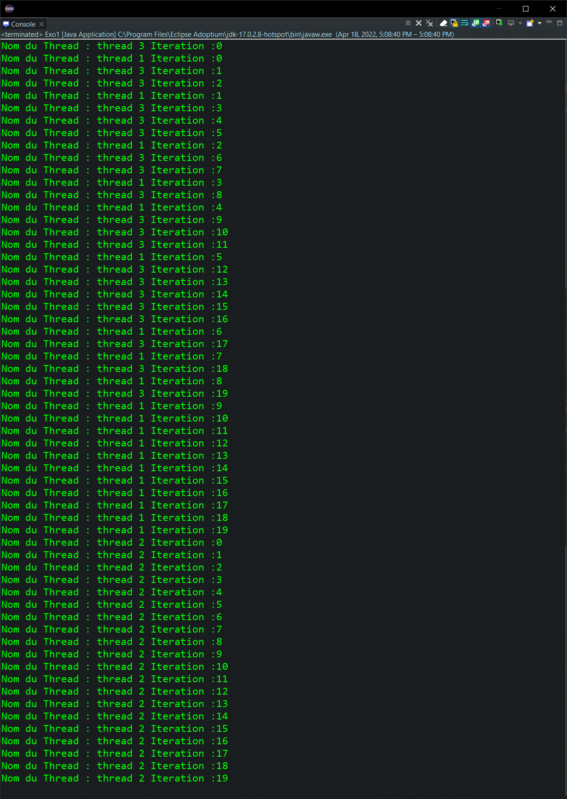
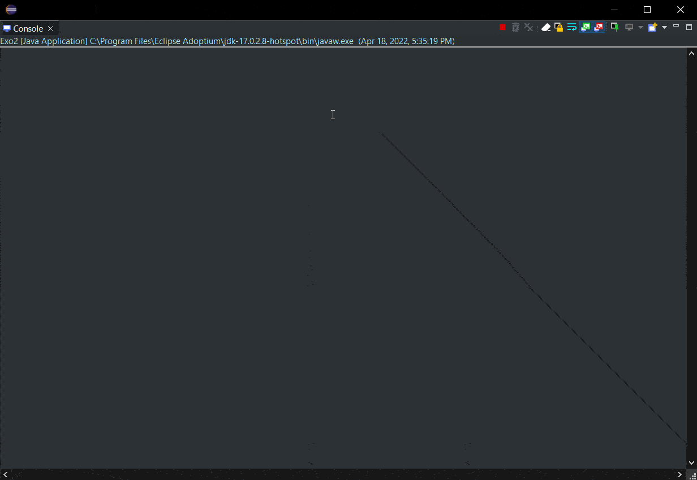
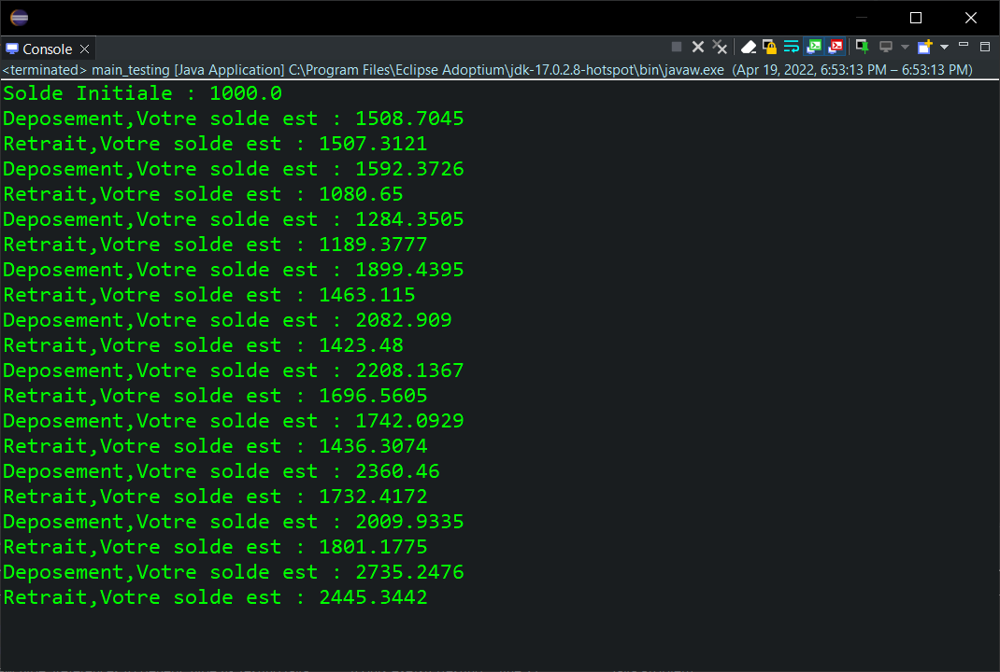

<div style="display:flex;justify-content:space-between">
    <div>
        <strong>
            Realise par :
        </strong>  
        <br>&nbsp;&nbsp;&nbsp;&nbsp;Yasser Nabouzi
        <br>&nbsp;&nbsp;&nbsp;&nbsp;Omar Lahbabi 
    </div>
    <div>
        <div>
            2021-2022
        </div>
        <div>
            
        </div>
    </div>
</div>
<br>
<div style="position:relative;bottom:51px">
    <strong>
        Filliere :
    </strong>  IID1
</div>
<div style = "text-align:center">
    <strong>
        Encadre par : 
    </strong>Noreddine GHERABI 
</div>
<div style="font-size:35px;font-weight:bold;text-align:center;">
    Rapport Des TPs Java
</div>

## Tp8
### Exo1:

#### Q1:
Creons un thread principal et nomme trois Threads :

```java
package Exo1;

class SideThread extends Thread {
	
	public SideThread(String name) {
		super(name);
	}

	
	public void run() {
		for (int i = 0; i < 20; i++) {			
			try {
                // Question 1
				sleep((int)Math.random()*200);
			} catch (InterruptedException e) {
				// TODO Auto-generated catch block
				e.printStackTrace();
			}	
            // Question 2
			System.out.println("Nom du Thread : "+getName()+" Iteration :"+i);
		}
	}
}

public class Exo1 {
	public static void main(String[] args) {
		SideThread T1 = new SideThread("thread 1");
        // Question 3
		T1.setPriority(10);
		SideThread T2 = new SideThread("thread 2");
		SideThread T3 = new SideThread("thread 3");
		T3.setPriority(1);
		T1.start();
		T3.start();
		try {
            // Question 3
			T1.join();
            T3.join();
		} catch (InterruptedException e) {
			e.printStackTrace();
		}
		T2.start();
	}
}
```

> INPUT / OUTPUT :
> 

### Exo 2 :
#### Q1 :
Creons deux class __Compte__ et __Personne__ :
- Class __Compte__ :
```java
public class Compte {
	private float solde;
	
	public Compte(float solde) {
		super();
		this.solde = solde;
	}
	public Compte() {
		super();
		this.solde = 100;
	}

	public float getSolde() {
		return solde;
	}

	public void setSolde(float solde) {
		this.solde = solde;
	}
	
	void retirer(float montant) {
		this.setSolde(this.getSolde() - montant); 
	}
}
```
- Class __Personne__ :
```java

public class Personne implements Runnable {
	Compte c;
	String name;
	
	public Personne(Compte c, String name) {
		super();
		this.c = c;
		this.name = name;
	}
	
	public void Retrait(float Montant) {
		if (Montant > c.getSolde()) {
			System.out.println("Solde insuffisant ");
		}else {
			c.retirer(Montant);			
		}
	}
	
	@Override
	public void run() {
		System.out.println("=====================\n"+"Compte : "+this.name+",Votre solde est "+c.getSolde());
		try {
			for (int i = 0; i < 10; i++) {
				Thread.sleep(2000);
				this.Retrait(200);				
				System.out.println("Retrait du compte de "+this.name+", solde actuelle :"+c.getSolde());
			}
		} catch (InterruptedException e) {
			e.printStackTrace();
		}	
	}	
}
```

Creons une methode main  cree deux threads __(Ahmed et amal)__ meme Runnable.

```java
public class Exo2 {
	public static void main(String[] args) {
		Compte c1 = new Compte(2000);
		Compte c2 = new Compte(3500);
		Personne Ahmed = new Personne(c1,"Ahmed");
		Personne Amal = new Personne(c2,"Amal");
		Thread ah = new Thread(Ahmed);
		Thread am = new Thread(Amal);
		ah.start();
		try {
			ah.join();
		} catch (InterruptedException e) {
			// TODO Auto-generated catch block
			e.printStackTrace();
		}
		am.start();
	}
}
```
> Input / Ouput :
> 

#### Q2 :  
Ajontons une class __SoldeCompte__ qui contient un attribut __solde__ avec les methodes de _deposement_ et _retiration_ synchroniser.

```java
package exo2;

public class SoldeCompte {
	private float Solde;
	
	public SoldeCompte(float solde) {
		super();
		this.setSolde(solde);;
	}
	public SoldeCompte() {}
	
	public float getSolde() {
		return Solde;
	}
	
	public void setSolde(float solde) {
		Solde = solde;
	}
	
	public synchronized void RetirerArgent(float montant) {
		if (this.getSolde() < montant) {
			System.out.println("Solde insifusant pour faire le retrait.");
			try {
				wait(200);
			} catch (InterruptedException e) {
				// TODO Auto-generated catch block
				e.printStackTrace();
			}
		}
		this.setSolde(this.getSolde()-montant);
		notifyAll();
	}
	
	public synchronized void DeposerArgent(float montant) {
		notifyAll();
		this.setSolde(montant+this.getSolde());
	}
}
```

- Creons des classes qui implemente l'interface __Runnable__ et qui a pour tache deposer et retirer une somme d'argent.
    
- class __Retirer :__
  
```java
package exo2;

public class retr implements Runnable{
	SoldeCompte S;
	
	public retr(SoldeCompte s) {
		S = s;
	}
	
	@Override
	public void run() {
		for (int i = 0; i < 10; i++) {
			S.RetirerArgent((float)Math.random()*1000);
			System.out.println("Retrait,Votre solde est : "+S.getSolde());
		}	
	}
}
``` 
- class __Deposer :__
```java
package exo2;

public class depo implements Runnable {
	SoldeCompte S;
	
	public depo(SoldeCompte s) {
		S = s;
	}
	
	@Override
	public void run() {
		for (int i = 0; i < 10; i++) {
			S.DeposerArgent((float)Math.random()*1000);
			System.out.println("Deposement,Votre solde est : "+S.getSolde());
		}	
	}
}
```

#### Q4 :

Creons deux threads qui effectuent plusieurs operations de retrait et depot d'arget simultanement.

```java
package exo2;

public class main_testing {

	public static void main(String[] args) {
		SoldeCompte s = new SoldeCompte(1000);
		depo d = new depo(s);
		retr r = new retr(s);
		Thread D = new Thread(d);
		Thread R = new Thread(r);
		D.start();
		R.start();
		System.out.println(s.getSolde());
	}
}
```
> Input / Ouput :
> 