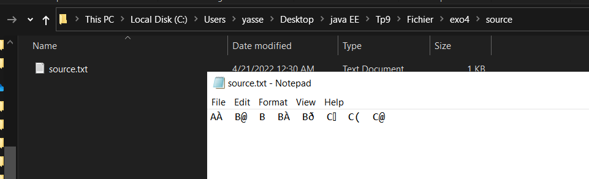
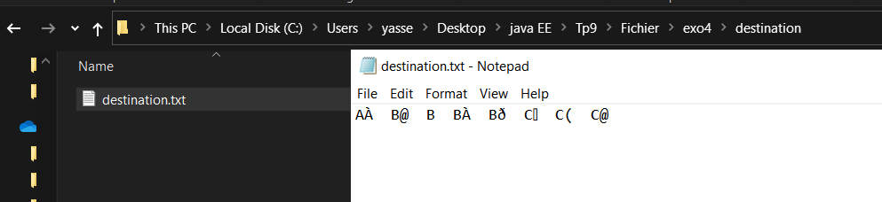
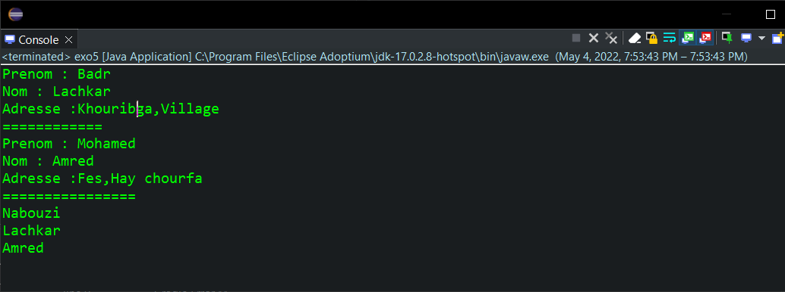
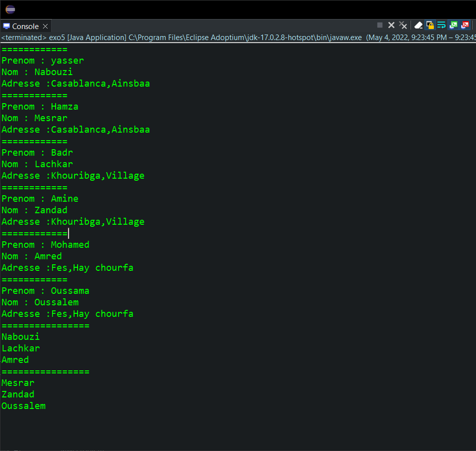

<div style="display:flex;justify-content:space-between">
    <div>
        <strong>
            Realise par :
        </strong>  
        <br>&nbsp;&nbsp;&nbsp;&nbsp;Yasser Nabouzi
        <br>&nbsp;&nbsp;&nbsp;&nbsp;Omar Lahbabi 
    </div>
    <div>
        <div>
            2021-2022
        </div>
        <div>
            
        </div>
    </div>
</div>
<br>
<div style="position:relative;bottom:51px">
    <strong>
        Filliere :
    </strong>  IID1
</div>
<div style = "text-align:center">
    <strong>
        Encadre par : 
    </strong>Noreddine GHERABI 
</div>
<div style="font-size:35px;font-weight:bold;text-align:center;">
    Rapport Des TPs Java
</div>

## TP9
### Exo 1 :
```java
package Exo1;

import java.io.BufferedWriter;
import java.io.FileNotFoundException;
import java.io.FileOutputStream;
import java.io.FileWriter;
import java.io.IOException;
import java.util.Scanner;

public class Exo1 {

	public static void main(String[] args) {
		Scanner scan = new Scanner(System.in);
		String s = "",NomFichier = "";
		System.out.println("Donner un nom pour le fichier :");
		NomFichier = scan.nextLine();
		try {
			FileWriter out = new FileWriter("Fichier/exo1/"+NomFichier+".txt");
			BufferedWriter BufferW = new BufferedWriter(out);
			do {
				System.out.println("Taper une ligne (\"Stop\" pour annuler):");
				s = scan.nextLine();
				if (!s.equalsIgnoreCase("stop")) {
					BufferW.write(s);
					BufferW.newLine();					
				}
			}
			while(!s.equalsIgnoreCase("stop"));
			BufferW.close();
			System.out.println("Fichier enregistrer dans le repertoire : Fichier/exo1/");
		} catch (FileNotFoundException e) {
			// TODO Auto-generated catch block
			e.printStackTrace();
		} catch (IOException e) {
			// TODO Auto-generated catch block
			e.printStackTrace();
		}		
	}
}
```

> Input / Ouput :
> 
> 

### Exo 2:
```java
package Exo2;

import java.io.BufferedReader;
import java.io.BufferedWriter;
import java.io.FileNotFoundException;
import java.io.FileReader;
import java.io.FileWriter;
import java.io.IOException;

public class CopieFile {

	public static void main(String[] args) {
		String s,tmp = "";
		int c = 0;
		int i = 0;
		try {
			FileReader input = new FileReader("Fichier/exo1/Hello World.txt");
			BufferedReader BufferR = new BufferedReader(input);
			FileWriter out = new FileWriter("Fichier/exo2/destination.txt");
			BufferedWriter BufferW = new BufferedWriter(out);
			//1er methode par Character
			while((c = BufferR.read()) != -1) {
				char Character = (char) c;
				tmp += Character;
				BufferW.write(Character);
				if(Character == '\n') {
					System.out.println("Writing in file : "+tmp+" line : "+i);
					tmp = "";
					i++;					
				}
			}
			//2eme methode
//			while(BufferR.ready()) {
//				s = BufferR.readLine();
//				BufferW.write(s+"\n");
//				System.out.println("Writing in file /destination.txt : line["+i+"] = "+s);
//				i++;
//			}
			BufferW.close();
			BufferR.close();
		} catch (FileNotFoundException e) {
			// TODO Auto-generated catch block
			e.printStackTrace();
		} catch (IOException e) {
			// TODO Auto-generated catch block
			e.printStackTrace();
		}
	}
}
```
Pronons le fichier d'exercice 1 comme source.

- 1er Methods
> Input / Ouput :
> 
> 
> 
- 2eme method
> Input / Ouput :
> 
> 


### Exo 3 :
Creons la class du multiplication qui a pour deux methodes __MultToFile()__ and __MultCheckFile()__ :
```java
package Exo3;

import java.io.DataInputStream;
import java.io.DataOutputStream;
import java.io.FileInputStream;
import java.io.FileNotFoundException;
import java.io.FileOutputStream;
import java.io.IOException;

public class MultiplicationInAFile {
	private float a;

	public float getA() {
		return a;
	}

	public void setA(float a) {
		this.a = a;
	}

	public MultiplicationInAFile(float a) {
		super();
		this.setA(a);;
	}
	
	public void MultToFile(int NbrMult){
		try {
			String s;
			FileOutputStream fr = new FileOutputStream("Fichier/exo3/MultToFile.txt");
			DataOutputStream out = new DataOutputStream(fr);
			for (int i = 1; i <= NbrMult; i++) {
				out.writeFloat(this.a*(float)i);
			}
		} catch (FileNotFoundException e) {
			// TODO Auto-generated catch block
			e.printStackTrace();
		} catch (IOException e) {
			// TODO Auto-generated catch block
			e.printStackTrace();
		}
	}
	
	public void MultCheckFile(){
		float var,i = 1;
		try {
			FileInputStream source = new FileInputStream("Fichier/exo3/MultToFile.txt");
			DataInputStream input = new DataInputStream(source);
			
			while((var = input.readFloat()) != 0) {
				System.out.println((float)(var/i) +" x "+i+" = "+var);
				i++;
			}
		} catch (FileNotFoundException e) {
			e.printStackTrace();
		} catch (IOException w) {} 
	}
	
	
	public static void main(String[] args) {
		MultiplicationInAFile m = new MultiplicationInAFile(24);
		m.MultToFile(8);
		m.MultCheckFile();
	}
}
```
> Input / Ouput :
> 

### Exo 4 :
```java
package exo4;

import java.io.FileInputStream;
import java.io.FileNotFoundException;
import java.io.FileOutputStream;
import java.io.IOException;

public class exo4 {

	public static void main(String[] args) {
		int oct;
		try {
			FileInputStream input = new FileInputStream("Fichier/exo4/source/source.txt");
			FileOutputStream out = new FileOutputStream("Fichier/exo4/destination/destination.txt");
			while((oct = input.read()) != -1) {
					out.write(oct);
				}
		} catch (FileNotFoundException e) {
			// TODO Auto-generated catch block
			e.printStackTrace();
		} catch(IOException I) {
			I.printStackTrace();
		}
	}
}
```
> Input / Ouput :
> 
> 

### Exo 5:
- Creons une class Client:
```java
package exo5;

import java.io.Serializable;

public class Client implements Serializable {
	String Nom,Prenom,Adress;

	public Client(String nom, String prenom, String adress) {
		super();
		Nom = nom;
		Prenom = prenom;
		Adress = adress;
	}
}
```
- Ecrivons un code java qui sauvgarde 3 client dans un fichier binaire "file.dot" :
```java
    public static void Sauvgarder() {
		try {
			Client C1 = new Client("Nabouzi", "yasser","Casablanca,Ainsbaa");
			Client C2 = new Client("Lachkar", "Badr","Khouribga,Village");
			Client C3 = new Client("Amred", "Mohamed","Fes,Hay chourfa");
			FileOutputStream out = new FileOutputStream("Fichier/exo5/file.dot");
			ObjectOutputStream outobj = new ObjectOutputStream(out);
			outobj.writeObject(C1);
			outobj.writeObject(C2);
			outobj.writeObject(C3);
			outobj.close();
			System.out.println("File created !!");
		
		} catch (FileNotFoundException e) {
			// TODO Auto-generated catch block
			e.printStackTrace();
		}	catch (IOException w) {
			w.printStackTrace();
		}
	}
```

- Creons un code java qui recharge les noms et les mettres dans un tableau.

```java
	public static void ReadFile(String FileInput) {
		Client p =null;
		String[] S = new String[3];
		int i = 0;
		try {
			FileInputStream input = new FileInputStream(FileInput);
			ObjectInputStream inputo = new ObjectInputStream(input);
			while((p = (Client)inputo.readObject()) != null){
				System.out.println("============\n"+"Prenom : "+p.Prenom+"\nNom : "+p.Nom+"\nAdresse :"+p.Adress);
				S[i] = p.Nom;
				i++;
			} 
			input.close();
			inputo.close();
		} catch (FileNotFoundException e) {
			// TODO Auto-generated catch block
//			e.printStackTrace();
		} catch (IOException w) {
//			w.printStackTrace();
		} catch(ClassNotFoundException c) {
//			c.printStackTrace();
		}
		System.out.println("================");
		// Tableau des nom des chaine de character
		for (String Name : S) {
			System.out.println(Name);
		}
	}
```

> Input / Ouput :
> 

- En utilisant deux Thread, lisons les donnes des deux fichiers sumultanement et affichons leurs nom et prenoms.

  - fichier 1:
    
  - fichier 2:
    

```java
public static class ThreadReadFile extends Thread{
String Fichier;
public ThreadReadFile(String fichier) {
	super();
	Fichier = fichier;
}
public void run() {
	ReadFile("Fichier/exo5/"+Fichier);
}
}
```

__Main__ 
```java
public static void main(String[] args) {
    //Sauvgarder();
    ThreadReadFile T1 = new ThreadReadFile("file.dot");
    ThreadReadFile T2 = new ThreadReadFile("file1.dot");
    T1.start();
    T2.start();
    //ReadFile("Fichier/exo5/file.dot");	
	}
```
>Input / Ouput :
